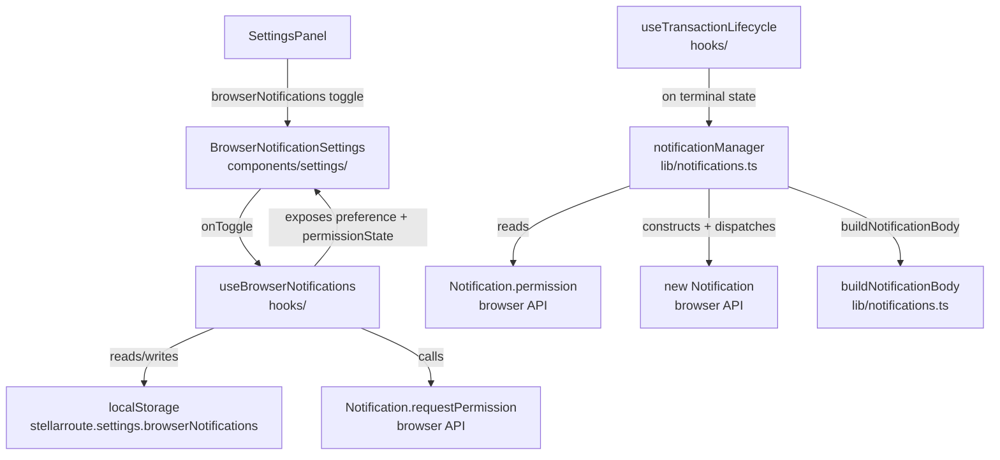
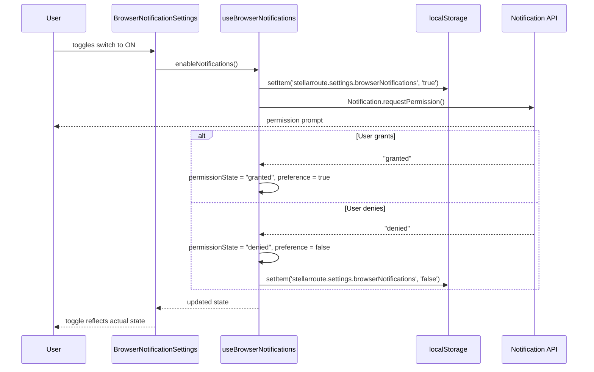
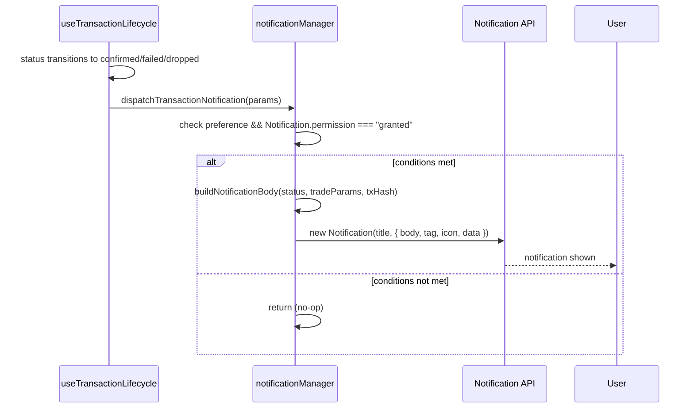

# Design Document: Browser Transaction Notifications

## Overview

StellarRoute users frequently navigate away from the tab while a swap is in-flight. This feature adds opt-in browser push notifications that fire when a swap reaches a terminal state (`confirmed`, `failed`, or `dropped`), giving users timely feedback without requiring the tab to stay focused.

The implementation is entirely opt-in and non-intrusive. The browser permission prompt is only shown when the user explicitly enables the setting. When permission is denied or the browser does not support the `Notification` API, the feature is a silent no-op — the swap flow is completely unaffected.

The design follows the existing patterns established by `useExpertSettings` (localStorage-backed settings hook) and `useTransactionLifecycle` (transaction state machine hook), keeping the new code consistent with the rest of the frontend.

## Architecture



### Module Responsibilities

| Module | Location | Responsibility |
|---|---|---|
| `notificationManager` | `frontend/lib/notifications.ts` | Pure functions: body construction, notification dispatch, permission guard |
| `useBrowserNotifications` | `frontend/hooks/useBrowserNotifications.ts` | React hook: preference persistence, permission request, state exposure |
| `BrowserNotificationSettings` | `frontend/components/settings/BrowserNotificationSettings.tsx` | UI toggle component for the settings panel |
| `SettingsPanel` | `frontend/components/settings/SettingsPanel.tsx` | Wires `BrowserNotificationSettings` into the existing drawer |
| `useTransactionLifecycle` | `frontend/hooks/useTransactionLifecycle.ts` | Calls `dispatchTransactionNotification` after each terminal transition |

The `notificationManager` functions are pure (no React, no hooks) so they are independently testable. The `useBrowserNotifications` hook owns all React state and side effects. This separation mirrors the existing pattern of `lib/` utilities consumed by `hooks/`.

## Sequence Diagrams

### Enable Notifications Flow



### Transaction Notification Dispatch Flow



## Components and Interfaces

### `notificationManager` (lib/notifications.ts)

Pure utility module. No React dependencies.

```typescript
export type TerminalStatus = 'confirmed' | 'failed' | 'dropped';

export interface NotificationParams {
  status: TerminalStatus;
  txHash?: string;
  fromAsset: string;
  fromAmount: string;
  toAsset: string;
  toAmount: string;
  txId: string;
}

export interface NotificationPreference {
  enabled: boolean;
}

/**
 * Constructs the notification title for a given terminal status.
 * Returns "Swap Confirmed" | "Swap Failed" | "Swap Dropped"
 */
export function buildNotificationTitle(status: TerminalStatus): string;

/**
 * Constructs the notification body string for a given terminal status.
 * - confirmed: "Swapped {fromAmount} {fromAsset} → {toAmount} {toAsset}\nTx: {txHash}"
 * - failed:    "Swap of {fromAmount} {fromAsset} → {toAmount} {toAsset} failed."
 * - dropped:   "Swap of {fromAmount} {fromAsset} → {toAmount} {toAsset} was dropped. You may resubmit."
 */
export function buildNotificationBody(params: NotificationParams): string;

/**
 * Constructs the Explorer URL for a confirmed transaction.
 * Returns "https://stellar.expert/explorer/public/tx/{txHash}"
 */
export function buildExplorerUrl(txHash: string): string;

/**
 * Dispatches a browser Notification for a terminal transaction state.
 * Guards: returns immediately (no-op, no throw) if:
 *   - preference.enabled is false
 *   - Notification API is unavailable
 *   - Notification.permission !== "granted"
 * Does NOT mutate params.
 */
export function dispatchTransactionNotification(
  params: NotificationParams,
  preference: NotificationPreference
): void;

/**
 * Returns true if the browser supports the Notification API.
 */
export function isNotificationSupported(): boolean;
```

### `useBrowserNotifications` (hooks/useBrowserNotifications.ts)

React hook that owns preference persistence and permission state.

```typescript
export interface BrowserNotificationsState {
  /** Whether the user has opted in (in-memory, reconciled with browser permission) */
  browserNotifications: boolean;
  /** Current browser permission state, or "unsupported" if API is unavailable */
  permissionState: NotificationPermission | 'unsupported';
  /** Whether the toggle should be disabled (permission denied or API unsupported) */
  isDisabled: boolean;
  /** Whether the hook has completed hydration from localStorage */
  isHydrated: boolean;
  /** Enable notifications: persists preference and calls requestPermission() */
  enableNotifications: () => Promise<void>;
  /** Disable notifications: persists preference, does NOT call requestPermission() */
  disableNotifications: () => void;
}

export function useBrowserNotifications(): BrowserNotificationsState;
```

**Initialisation sequence** (mirrors `useExpertSettings` pattern):
1. On mount, read `localStorage.getItem('stellarroute.settings.browserNotifications')` inside a try/catch.
2. Read `Notification.permission` from the browser (if API is available).
3. If `Notification.permission === 'denied'`, set in-memory preference to `false` regardless of localStorage value. Do NOT write back to localStorage.
4. Set `isHydrated = true` via `queueMicrotask` (same pattern as `useExpertSettings`).

**`enableNotifications()`**:
1. Write `'true'` to `localStorage` key.
2. Update in-memory preference to `true`.
3. Call `Notification.requestPermission()`.
4. If result is `'granted'`: set `permissionState = 'granted'`, leave preference `true`.
5. If result is `'denied'` or `'default'`: set `permissionState` accordingly, set preference to `false`, write `'false'` to localStorage.

**`disableNotifications()`**:
1. Write `'false'` to `localStorage` key.
2. Update in-memory preference to `false`.
3. Do NOT call `Notification.requestPermission()`.

### `BrowserNotificationSettings` (components/settings/BrowserNotificationSettings.tsx)

Presentational component that renders the toggle row in the settings panel.

```typescript
export interface BrowserNotificationSettingsProps {
  browserNotifications: boolean;
  permissionState: NotificationPermission | 'unsupported';
  isDisabled: boolean;
  onEnable: () => Promise<void>;
  onDisable: () => void;
}
```

**Rendering rules**:
- When `isDisabled` is `true` and `permissionState === 'denied'`: render toggle in disabled state with `aria-label` containing "blocked by browser".
- When `isDisabled` is `true` and `permissionState === 'unsupported'`: render toggle in disabled state with `aria-label` containing "not supported".
- Otherwise: render an interactive toggle switch (same visual style as the Expert Mode toggle in `ExpertSettings.tsx`).
- The toggle always has an `aria-label` describing its current state and purpose (e.g., `"Browser notifications: enabled"` / `"Browser notifications: disabled"`).

### `SettingsPanel` (modified)

`SettingsPanel` gains `browserNotifications`, `permissionState`, `isDisabled`, `onEnableNotifications`, and `onDisableNotifications` props, and renders `<BrowserNotificationSettings>` inside the settings drawer alongside the existing sections.

### `useTransactionLifecycle` (modified)

After each terminal state transition (`confirmed`, `failed`, `dropped`), the hook calls `dispatchTransactionNotification` with the current `tradeParams`, `txHash`, and `txId`. The notification preference is passed in as an injectable option (defaulting to `{ enabled: false }`) so the hook remains testable without a real settings store.

```typescript
interface UseTransactionLifecycleOptions {
  deadlineMs?: number;
  signTransaction?: (xdr: string) => Promise<string>;
  submitTransaction?: (signedXdr: string) => Promise<{ hash: string }>;
  /** Notification preference — injected to keep the hook testable */
  notificationPreference?: NotificationPreference;
}
```

## Data Models

### localStorage Key

```
stellarroute.settings.browserNotifications  →  "true" | "false"
```

Stored as a string (matching the existing pattern for all `stellarroute.settings.*` keys). Absent key is treated as `false`.

### `NotificationParams`

Derived from `TradeParams` (already in `useTransactionLifecycle`) plus the terminal status and transaction id. No new persistence types are needed.

```typescript
// Mapping from TradeParams + lifecycle state to NotificationParams
const params: NotificationParams = {
  status: status as TerminalStatus,   // 'confirmed' | 'failed' | 'dropped'
  txHash: txHash,                      // undefined for failed/dropped
  fromAsset: tradeParams.fromAsset,
  fromAmount: tradeParams.fromAmount,
  toAsset: tradeParams.toAsset,
  toAmount: tradeParams.toAmount,
  txId: txIdRef.current ?? '',
};
```

### Browser `Notification` Options

```typescript
// Constructed inside dispatchTransactionNotification
const options: NotificationOptions = {
  body: buildNotificationBody(params),
  tag: params.txId,                    // deduplicates notifications for same tx
  icon: '/icons/icon-192.png',
  data: params.status === 'confirmed'
    ? { url: buildExplorerUrl(params.txHash!) }
    : undefined,
};
new Notification(buildNotificationTitle(params.status), options);
```

### Notification Body Templates

| Status | Template |
|---|---|
| `confirmed` | `"Swapped {fromAmount} {fromAsset} → {toAmount} {toAsset}\nTx: {txHash}"` |
| `failed` | `"Swap of {fromAmount} {fromAsset} → {toAmount} {toAsset} failed."` |
| `dropped` | `"Swap of {fromAmount} {fromAsset} → {toAmount} {toAsset} was dropped. You may resubmit."` |

## Correctness Properties

*A property is a characteristic or behavior that should hold true across all valid executions of a system — essentially, a formal statement about what the system should do. Properties serve as the bridge between human-readable specifications and machine-verifiable correctness guarantees.*

### Property 1: Notification body contains all swap summary fields for any terminal status

*For any* valid `NotificationParams` with any combination of `fromAsset`, `fromAmount`, `toAsset`, `toAmount` values and any terminal status (`confirmed`, `failed`, or `dropped`), the string returned by `buildNotificationBody` SHALL contain `fromAsset`, `fromAmount`, `toAsset`, and `toAmount` verbatim.

**Validates: Requirements 3.6, 6.6**

---

### Property 2: Confirmed notification body matches exact template

*For any* confirmed transaction with any `fromAmount`, `fromAsset`, `toAmount`, `toAsset`, and `txHash` values, `buildNotificationBody` SHALL return exactly `"Swapped {fromAmount} {fromAsset} → {toAmount} {toAsset}\nTx: {txHash}"`.

**Validates: Requirements 6.1**

---

### Property 3: Failed and dropped notification bodies match exact templates

*For any* failed transaction with any `fromAmount`, `fromAsset`, `toAmount`, `toAsset` values, `buildNotificationBody` SHALL return exactly `"Swap of {fromAmount} {fromAsset} → {toAmount} {toAsset} failed."`. *For any* dropped transaction with the same fields, it SHALL return exactly `"Swap of {fromAmount} {fromAsset} → {toAmount} {toAsset} was dropped. You may resubmit."`.

**Validates: Requirements 6.2, 6.3**

---

### Property 4: No notification is dispatched when preference is false or permission is not granted

*For any* `NotificationParams` with any terminal status, calling `dispatchTransactionNotification` with `preference.enabled === false` OR with `Notification.permission !== "granted"` SHALL NOT construct a `Notification` object and SHALL NOT throw an error.

**Validates: Requirements 3.7, 4.1, 4.2, 4.4**

---

### Property 5: Dispatch does not mutate the transaction params

*For any* `NotificationParams` object, calling `dispatchTransactionNotification` (regardless of permission state) SHALL leave the params object deeply equal to its original value — `status`, `txHash`, `fromAsset`, `fromAmount`, `toAsset`, `toAmount`, and `txId` are all unchanged.

**Validates: Requirements 4.5**

---

### Property 6: Notification tag equals transaction id for any dispatched notification

*For any* `NotificationParams` with any `txId` value, when `dispatchTransactionNotification` dispatches a notification (preference enabled, permission granted), the `Notification` constructor SHALL be called with `options.tag === params.txId`.

**Validates: Requirements 6.4**

---

### Property 7: Preference persistence round-trip

*For any* boolean preference value written via `useBrowserNotifications`, reading `localStorage.getItem('stellarroute.settings.browserNotifications')` SHALL return the string `"true"` or `"false"` corresponding to that value, and re-initialising the hook SHALL restore the same in-memory boolean value.

**Validates: Requirements 2.2, 2.3**

---

### Property 8: Toggle aria-label describes current state for any boolean value

*For any* boolean value of `browserNotifications` (when the toggle is not disabled), the `BrowserNotificationSettings` component SHALL render a toggle element whose `aria-label` is non-empty and contains text describing whether notifications are currently enabled or disabled.

**Validates: Requirements 5.6**

---

### Property 9: Explorer URL contains the transaction hash for any non-empty hash

*For any* non-empty transaction hash string, `buildExplorerUrl(txHash)` SHALL return a string that starts with `"https://stellar.expert/explorer/public/tx/"` and contains `txHash` verbatim.

**Validates: Requirements 3.5**

---

### Property 10: Correct notification title for each terminal status

*For any* terminal status value drawn from `{'confirmed', 'failed', 'dropped'}`, `buildNotificationTitle(status)` SHALL return `"Swap Confirmed"`, `"Swap Failed"`, or `"Swap Dropped"` respectively, and `dispatchTransactionNotification` (when conditions are met) SHALL pass that title to the `Notification` constructor.

**Validates: Requirements 3.1, 3.2, 3.3**

---

**Property Reflection — Redundancy Check:**

- Properties 2 and 3 are more specific than Property 1 (they test exact format, not just containment). Property 1 is kept as a general containment check; Properties 2 and 3 are kept as exact-format checks. No redundancy — they test different things.
- Property 4 covers 4.1, 4.2, and 4.4 together (no dispatch + no throw for any non-granted state). These were separate criteria but collapse into one property.
- Property 10 covers 3.1, 3.2, and 3.3 together (title per status). These were three separate criteria but the property is more concise as a single universal statement over the status enum.
- Properties 6 and 9 are independent (tag vs. URL) and both kept.

## Error Handling

### `Notification` API unavailable

`isNotificationSupported()` checks `typeof window !== 'undefined' && 'Notification' in window`. All functions in `lib/notifications.ts` call this guard first and return immediately if unsupported. `useBrowserNotifications` sets `permissionState = 'unsupported'` and `isDisabled = true`.

### `localStorage` read/write failure

All `localStorage` calls in `useBrowserNotifications` are wrapped in try/catch, matching the pattern in `useExpertSettings`. On failure: log `console.error`, treat preference as `false`, do not surface to the user.

### `Notification.requestPermission()` failure

If `requestPermission()` rejects (rare, but possible in some browsers), the rejection is caught in `enableNotifications()`. The preference is set to `false` and the error is logged to the console.

### Permission revoked after grant

`dispatchTransactionNotification` reads `Notification.permission` at call time (not cached). If the user revokes permission in browser settings after granting it, subsequent dispatch calls will see `permission !== 'granted'` and silently no-op. No error is thrown.

### `new Notification()` constructor throws

Wrapped in a try/catch inside `dispatchTransactionNotification`. Any error is logged to the console and swallowed — the swap flow is never interrupted.

## Testing Strategy

### Unit tests (Vitest + @testing-library/react)

**`lib/notifications.test.ts`** — pure function tests:
- `buildNotificationTitle` returns correct title for each of the three terminal statuses.
- `buildNotificationBody` returns correct body for each status with concrete example values.
- `buildExplorerUrl` returns correct URL for a concrete hash.
- `dispatchTransactionNotification` does not call `new Notification()` when preference is `false`.
- `dispatchTransactionNotification` does not call `new Notification()` when `Notification.permission` is `'denied'`.
- `dispatchTransactionNotification` does not throw when `window.Notification` is undefined.
- `dispatchTransactionNotification` sets `tag`, `icon`, and `data.url` correctly for a confirmed transaction.
- `isNotificationSupported` returns `false` when `window.Notification` is absent.

**`hooks/useBrowserNotifications.test.ts`** — hook tests using `renderHook`:
- Initialises with `false` when localStorage key is absent.
- Restores `true` from localStorage on mount.
- Overrides to `false` when `Notification.permission === 'denied'` regardless of localStorage.
- `enableNotifications()` calls `Notification.requestPermission()` exactly once.
- `enableNotifications()` sets preference to `false` when permission is denied.
- `disableNotifications()` does NOT call `Notification.requestPermission()`.
- localStorage errors are caught and preference defaults to `false`.

**`components/settings/BrowserNotificationSettings.test.tsx`** — component tests:
- Renders enabled toggle when `browserNotifications=true` and permission is granted.
- Renders disabled toggle with "blocked by browser" label when `permissionState='denied'`.
- Renders disabled toggle with "not supported" label when `permissionState='unsupported'`.
- Clicking the toggle calls `onEnable` or `onDisable` appropriately.
- `aria-label` is present and non-empty in all states.

### Property-based tests (fast-check, Vitest)

`fast-check@3.22.0` is already in `devDependencies`. Each property test runs a minimum of 100 iterations. Tag format: `// Feature: browser-transaction-notifications, Property {N}: {title}`.

**Property 1** — `lib/notifications.property.test.ts`:
Generate arbitrary `fromAsset`, `fromAmount`, `toAsset`, `toAmount` strings (non-empty) and arbitrary terminal status. Call `buildNotificationBody`. Assert all four values appear in the result.
```
// Feature: browser-transaction-notifications, Property 1: Notification body contains all swap summary fields
```

**Properties 2 & 3** — `lib/notifications.property.test.ts`:
Generate arbitrary non-empty strings for all five fields. Call `buildNotificationBody` with `status='confirmed'`. Assert exact template match. Repeat for `'failed'` and `'dropped'`.
```
// Feature: browser-transaction-notifications, Property 2: Confirmed notification body matches exact template
// Feature: browser-transaction-notifications, Property 3: Failed and dropped notification bodies match exact templates
```

**Property 4** — `lib/notifications.property.test.ts`:
Generate arbitrary `NotificationParams`. Mock `Notification` constructor. Call `dispatchTransactionNotification` with `preference.enabled=false`. Assert constructor not called and no exception thrown. Repeat with `Notification.permission='denied'`.
```
// Feature: browser-transaction-notifications, Property 4: No notification dispatched when preference false or permission not granted
```

**Property 5** — `lib/notifications.property.test.ts`:
Generate arbitrary `NotificationParams`. Deep-clone before call. Call `dispatchTransactionNotification` with denied permission. Assert params deep-equal to clone.
```
// Feature: browser-transaction-notifications, Property 5: Dispatch does not mutate transaction params
```

**Property 6** — `lib/notifications.property.test.ts`:
Generate arbitrary `txId` strings. Call `dispatchTransactionNotification` with granted permission. Assert `Notification` constructor received `options.tag === txId`.
```
// Feature: browser-transaction-notifications, Property 6: Notification tag equals transaction id
```

**Property 7** — `hooks/useBrowserNotifications.property.test.ts`:
Generate arbitrary boolean values. Set localStorage, render hook, assert in-memory value matches. Also assert localStorage contains `"true"` or `"false"` string.
```
// Feature: browser-transaction-notifications, Property 7: Preference persistence round-trip
```

**Property 8** — `components/settings/BrowserNotificationSettings.property.test.tsx`:
Generate arbitrary boolean values for `browserNotifications` (with `isDisabled=false`). Render component. Assert `aria-label` is non-empty.
```
// Feature: browser-transaction-notifications, Property 8: Toggle aria-label describes current state
```

**Property 9** — `lib/notifications.property.test.ts`:
Generate arbitrary non-empty strings as `txHash`. Call `buildExplorerUrl`. Assert result starts with `"https://stellar.expert/explorer/public/tx/"` and contains `txHash`.
```
// Feature: browser-transaction-notifications, Property 9: Explorer URL contains transaction hash
```

**Property 10** — `lib/notifications.property.test.ts`:
Generate arbitrary terminal status values using `fc.constantFrom('confirmed', 'failed', 'dropped')`. Call `buildNotificationTitle`. Assert correct title for each. Also mock `Notification` constructor and call `dispatchTransactionNotification` with granted permission, assert title passed to constructor matches.
```
// Feature: browser-transaction-notifications, Property 10: Correct notification title for each terminal status
```

### Integration tests

- `useTransactionLifecycle` integration: mock `dispatchTransactionNotification`, run the hook through `confirmed`, `failed`, and `dropped` transitions, assert the mock was called once per terminal transition with correct params.
- `SettingsPanel` integration: render the full panel with `useBrowserNotifications` wired in, verify the `BrowserNotificationSettings` section is present.

## Dependencies

All dependencies are already present in the project:

| Dependency | Usage |
|---|---|
| `fast-check@3.22.0` | Property-based tests |
| `vitest` | Test runner |
| `@testing-library/react` | Hook and component tests |
| `lucide-react` | `Bell`, `BellOff` icons for the toggle |
| `localStorage` (browser) | Preference persistence |
| `Notification` API (browser) | Permission request and notification dispatch |

No new runtime dependencies are required.
