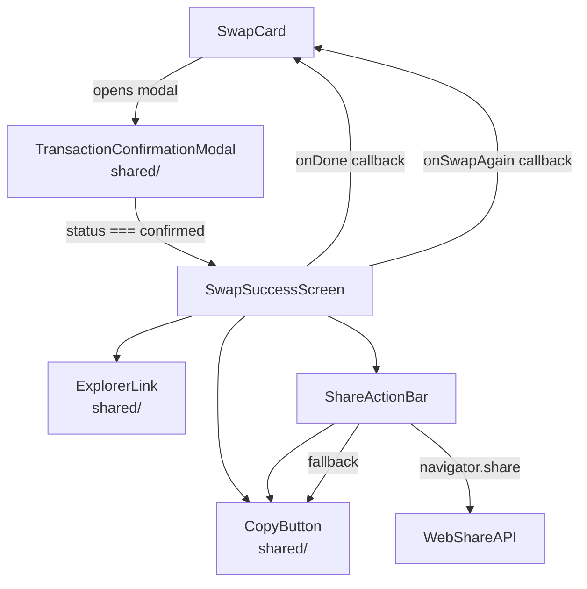
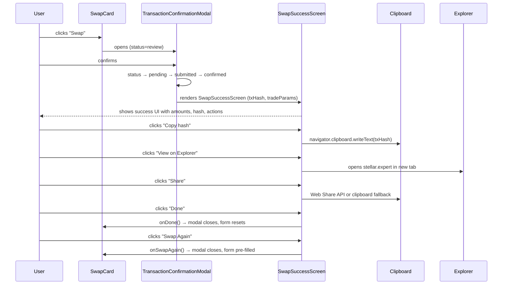

# Design Document: Post-Swap Success Screen

## Overview

After a swap is confirmed on the Stellar network, StellarRoute currently shows a minimal "Swap confirmed" state inside the `TransactionConfirmationModal`. This feature replaces that inline confirmed state with a dedicated, full-panel success screen that surfaces the transaction hash, a one-click explorer link, and share/copy actions — giving users a clear, celebratory endpoint to the swap flow before they return to the swap form.

The success screen is rendered as a new component, `SwapSuccessScreen`, that is displayed in place of the `TransactionConfirmationModal` content when `status === 'confirmed'`. It is not a separate page/route; it lives inside the existing modal shell so the swap flow remains a single-page experience consistent with the rest of the UI.

## Architecture



The `SwapSuccessScreen` is a pure presentational component. All state (txHash, tradeParams) flows in as props from `TransactionConfirmationModal`, which already owns the transaction lifecycle via `useTransactionLifecycle`.

## Sequence Diagram — Confirmed Flow



## Components and Interfaces

### SwapSuccessScreen

**Location**: `frontend/components/swap/SwapSuccessScreen.tsx`

**Purpose**: Dedicated success view rendered inside `TransactionConfirmationModal` when `status === 'confirmed'`. Displays swap summary, transaction hash, explorer link, and share/copy actions.

**Interface**:
```typescript
export interface SwapSuccessScreenProps {
  /** Confirmed on-chain transaction hash */
  txHash: string;
  /** Trade details for the summary panel */
  tradeParams: {
    fromAsset: string;
    fromAmount: string;
    toAsset: string;
    toAmount: string;
    networkFee: string;
  };
  /** Called when user clicks "Done" — closes modal and resets form */
  onDone: () => void;
  /** Called when user clicks "Swap Again" — closes modal, keeps pair pre-filled */
  onSwapAgain: () => void;
}
```

**Responsibilities**:
- Render the success icon, heading, and swap summary
- Render the truncated tx hash with a `CopyButton`
- Render the `ExplorerLink` to stellar.expert
- Render the `ShareActionBar` for share/copy actions
- Announce success to screen readers via `aria-live`
- Auto-focus the primary "Done" button on mount

### ShareActionBar

**Location**: `frontend/components/swap/ShareActionBar.tsx`

**Purpose**: Encapsulates the share/copy actions for a confirmed swap. Tries `navigator.share` first; falls back to clipboard copy.

**Interface**:
```typescript
export interface ShareActionBarProps {
  /** The text/URL to share */
  shareText: string;
  /** Share dialog title (used by Web Share API) */
  shareTitle?: string;
  /** Accessible label for the share button */
  label?: string;
  className?: string;
}
```

**Responsibilities**:
- Detect `navigator.share` availability
- Call `navigator.share` when available; fall back to `useCopyToClipboard`
- Show a transient "Copied!" / "Shared!" confirmation state
- Expose a single `Share` button with icon

### ExplorerLink (existing — no changes needed)

**Location**: `frontend/components/shared/ExplorerLink.tsx`

The existing component already constructs `https://stellar.expert/explorer/public/tx/{hash}` and sets `target="_blank" rel="noreferrer noopener"`. It is reused as-is.

### TransactionConfirmationModal (modified)

The `confirmed` state block inside both `frontend/components/swap/TransactionConfirmationModal.tsx` and `frontend/components/shared/TransactionConfirmationModal.tsx` is replaced with `<SwapSuccessScreen>`. The `onDone` and a new `onSwapAgain` prop are threaded through.

## Data Models

### SwapSuccessSummary

Derived from the existing `TradeParams` type in `hooks/useTransactionLifecycle.ts`. No new types are needed; `SwapSuccessScreenProps` references the relevant subset inline.

```typescript
// Subset of TradeParams used by the success screen
type SwapSuccessSummary = Pick<
  TradeParams,
  'fromAsset' | 'fromAmount' | 'toAsset' | 'toAmount' | 'networkFee'
>;
```

### Explorer URL Construction

```typescript
// lib/explorer.ts  (new, thin utility)
export type StellarNetwork = 'public' | 'testnet';

export function buildExplorerUrl(
  txHash: string,
  network: StellarNetwork = 'public'
): string {
  return `https://stellar.expert/explorer/${network}/tx/${txHash}`;
}
```

This extracts the URL pattern currently hardcoded in `ExplorerLink` into a testable utility, and adds testnet support for future use. `ExplorerLink` will be updated to accept an optional `network` prop that defaults to `'public'`.

### Share Text Construction

```typescript
// Constructed inside SwapSuccessScreen
function buildShareText(
  fromAmount: string,
  fromAsset: string,
  toAmount: string,
  toAsset: string,
  txHash: string
): string {
  return (
    `Just swapped ${fromAmount} ${fromAsset} → ${toAmount} ${toAsset} on StellarRoute!\n` +
    `https://stellar.expert/explorer/public/tx/${txHash}`
  );
}
```

## Key Functions with Formal Specifications

### buildExplorerUrl

```typescript
function buildExplorerUrl(txHash: string, network: StellarNetwork): string
```

**Preconditions**:
- `txHash` is a non-empty string
- `network` is `'public'` or `'testnet'`

**Postconditions**:
- Returns a string starting with `https://stellar.expert/explorer/`
- The returned URL contains `txHash` verbatim
- The returned URL contains the `network` segment

**Loop Invariants**: N/A

### buildShareText

```typescript
function buildShareText(
  fromAmount: string, fromAsset: string,
  toAmount: string, toAsset: string,
  txHash: string
): string
```

**Preconditions**:
- All string arguments are non-empty

**Postconditions**:
- Returned string contains `fromAmount`, `fromAsset`, `toAmount`, `toAsset`
- Returned string contains `txHash`
- Returned string contains the stellar.expert URL

### SwapSuccessScreen (component)

**Preconditions**:
- `txHash` is non-empty (component renders nothing meaningful for empty hash)
- `tradeParams` contains valid, non-empty asset/amount strings
- `onDone` and `onSwapAgain` are stable callback references

**Postconditions**:
- On mount: primary "Done" button receives focus
- On mount: `aria-live` region announces "Swap confirmed"
- Clicking "Done" calls `onDone` exactly once
- Clicking "Swap Again" calls `onSwapAgain` exactly once
- Clicking "Copy hash" writes `txHash` to clipboard and shows transient feedback
- Explorer link `href` equals `buildExplorerUrl(txHash, 'public')`

## Algorithmic Pseudocode

### Share Action Handler

```pascal
PROCEDURE handleShare(shareText, shareTitle)
  INPUT: shareText: String, shareTitle: String
  OUTPUT: void (side effects: clipboard write or native share sheet)

  IF navigator.share IS available THEN
    TRY
      AWAIT navigator.share({ title: shareTitle, text: shareText })
    CATCH error
      IF error.name ≠ "AbortError" THEN
        toast.error("Failed to share")
      END IF
    END TRY
  ELSE
    AWAIT navigator.clipboard.writeText(shareText)
    setCopied(true)
    toast.success("Copied to clipboard")
    AFTER 2000ms: setCopied(false)
  END IF
END PROCEDURE
```

**Preconditions**:
- `shareText` is non-empty
- Component is mounted in a browser context

**Postconditions**:
- If `navigator.share` available and not aborted: native share sheet shown
- If `navigator.share` unavailable: `shareText` written to clipboard
- User receives toast feedback in both paths

**Loop Invariants**: N/A

## Example Usage

```tsx
// Inside TransactionConfirmationModal, replacing the confirmed state block:
{status === 'confirmed' && txHash && tradeParams && (
  <SwapSuccessScreen
    txHash={txHash}
    tradeParams={tradeParams}
    onDone={onDone}
    onSwapAgain={() => {
      onDone();          // close modal
      // SwapCard resets form via its own onDone handler
    }}
  />
)}

// Standalone usage in tests:
<SwapSuccessScreen
  txHash="abc123def456"
  tradeParams={{
    fromAsset: 'XLM',
    fromAmount: '100',
    toAsset: 'USDC',
    toAmount: '9.85',
    networkFee: '0.00001',
  }}
  onDone={() => console.log('done')}
  onSwapAgain={() => console.log('swap again')}
/>
```

## Correctness Properties

1. For any non-empty `txHash`, `buildExplorerUrl(txHash, 'public')` returns a URL that contains `txHash` and starts with `https://stellar.expert/explorer/public/tx/`.

2. For any non-empty `txHash`, `buildExplorerUrl(txHash, 'testnet')` returns a URL containing `testnet` in the path.

3. `SwapSuccessScreen` always renders an element with `role="status"` or an `aria-live` region that announces "Swap confirmed" on mount.

4. `SwapSuccessScreen` always renders a link whose `href` equals `buildExplorerUrl(txHash, 'public')` when `txHash` is non-empty.

5. Clicking the "Done" button calls `onDone` exactly once and does not call `onSwapAgain`.

6. Clicking the "Swap Again" button calls `onSwapAgain` exactly once and does not call `onDone`.

7. `buildShareText` always includes `txHash` in the returned string for any non-empty inputs.

8. When `navigator.share` is unavailable, `handleShare` writes `shareText` to the clipboard and shows a success toast.

## Error Handling

### Missing txHash

If `txHash` is undefined or empty (e.g., the lifecycle hook hasn't resolved yet), `SwapSuccessScreen` falls back to showing the success heading and trade summary without the hash row and explorer link. The copy and share buttons are hidden.

```typescript
// Guard inside SwapSuccessScreen
const hasHash = Boolean(txHash && txHash.length > 0);
```

### Clipboard Unavailable

`useCopyToClipboard` (existing hook) already handles `navigator.clipboard` being undefined and shows a `toast.error`. No additional handling needed in `SwapSuccessScreen`.

### Web Share API Rejection

`AbortError` (user cancelled the share sheet) is silently swallowed. Other errors show `toast.error("Failed to share")`.

### Network / Explorer Unavailability

The explorer link is a plain `<a>` tag. If stellar.expert is unreachable, the browser handles it. No in-app error handling is needed.

## Testing Strategy

### Unit Testing Approach

Tests live in `frontend/components/swap/SwapSuccessScreen.test.tsx` using Vitest + React Testing Library, consistent with the existing test setup.

Key test cases:
- Renders success heading and trade summary with correct amounts
- Renders explorer link with correct `href` for a given `txHash`
- Renders nothing for the hash row when `txHash` is empty
- "Done" button is focused on mount
- Clicking "Done" calls `onDone` once
- Clicking "Swap Again" calls `onSwapAgain` once
- `aria-live` region contains "Swap confirmed" text
- Copy button triggers clipboard write (mock `navigator.clipboard`)
- Share button calls `navigator.share` when available
- Share button falls back to clipboard when `navigator.share` is absent

### Property-Based Testing Approach

**Property Test Library**: fast-check (already in devDependencies at `3.22.0`)

Properties to test with fast-check:
- `buildExplorerUrl(hash, network)` always contains `hash` for any non-empty string hash
- `buildShareText(...)` always contains all five input strings in the output
- `ExplorerLink` renders a well-formed anchor for any non-empty hash (extends existing PBT in `ExplorerLink.test.tsx`)

### Integration Testing Approach

The existing `TransactionConfirmationModal` tests in `frontend/components/shared/TransactionConfirmationModal.test.tsx` are updated to assert that the `confirmed` state renders `SwapSuccessScreen` content (explorer link, copy button, "Done" and "Swap Again" buttons).

## Performance Considerations

`SwapSuccessScreen` is a lightweight presentational component with no data fetching. It is rendered only after a confirmed transaction, so it is not on the critical render path. No lazy loading or memoization is required beyond standard React rendering.

## Security Considerations

- The explorer URL is constructed from `txHash` which comes from the Stellar network response. It is used only as an `href` attribute in an anchor tag — no `innerHTML` or `eval` usage.
- `rel="noreferrer noopener"` is already set on `ExplorerLink`, preventing tab-napping.
- `navigator.share` and `navigator.clipboard` are browser APIs; no user data is sent to third-party servers by this feature.
- The share text includes the tx hash and amounts, which are already public on-chain data.

## Dependencies

All dependencies are already present in the project:

| Dependency | Usage |
|---|---|
| `lucide-react` | `CheckCircle2`, `Share2`, `Copy`, `Check`, `ExternalLink` icons |
| `sonner` | Toast notifications for copy/share feedback |
| `@testing-library/react` | Component tests |
| `fast-check` | Property-based tests |
| `useCopyToClipboard` | Existing hook for clipboard operations |
| `ExplorerLink` | Existing shared component |
| `CopyButton` | Existing shared component |
| `cn` | Tailwind class merging utility |
