# Design Document: Print-Friendly Quote Summary

## Overview

This feature adds a print-friendly layout to the StellarRoute swap card so users can produce a clean paper or PDF record of a quote. The implementation is almost entirely CSS-driven: a `@media print` block in `globals.css` and Tailwind `print:` variant utilities applied to existing components. Two small new components are introduced — `PrintHeader` and `PrintButton` — and minor, additive changes are made to `SwapCard`, `PriceInfoPanel`, `RouteDisplay`, and `FeeBreakdownPanel`.

No new runtime dependencies, no new data-fetching, and no new state management are required.

### Key Design Decisions

- **CSS-first, not JS-first.** All print visibility rules are expressed as CSS classes (`print:hidden`, `print:block`, `@media print { … }`). This means print styles apply even when scripts are blocked during print rendering (Requirement 7.4) and are maintainable across browser versions (Requirement 7.3).
- **Additive changes only.** Existing components receive new Tailwind classes; their screen-mode behaviour is unchanged.
- **`RouteDisplay` gets a `forcePrintExpanded` prop** to satisfy the requirement that per-hop details are always visible in print view (Requirement 3.4), without coupling the component to `window.matchMedia`.
- **`PrintHeader` is screen-hidden by default** (`hidden print:block`) so it never appears in the normal UI.
- **`PrintButton` is print-hidden** (`print:hidden`) so it never appears in the printed output.

---

## Architecture

```mermaid
graph TD
    SwapCard --> PrintHeader
    SwapCard --> PriceInfoPanel
    SwapCard --> RouteDisplay
    SwapCard --> FeeBreakdownPanel
    SwapCard --> PrintButton

    subgraph "Print Region (visible in @media print)"
        PrintHeader
        PriceInfoPanel
        RouteDisplay
        FeeBreakdownPanel
    end

    subgraph "Hidden in @media print (print:hidden)"
        NavBar[Site Nav Bar]
        SettingsTrigger[Settings Trigger]
        TokenSelectors[Token Selectors]
        AmountInputs[Amount Inputs]
        SwapButton[Swap / Connect Button]
        ShareButton[Share Quote Button]
        ExportButtons[Export JSON/CSV Buttons]
        RefreshButton[Refresh Button]
        CompactToggle[Compact/Expand Toggle]
        Sparkline[Price Sparkline]
        PrintButton
    end

    globals.css -->|"@media print"| PrintRegionStyles[Page margins, font sizes,\nno shadows/blur, break-inside-avoid]
```



The print region is not a separate DOM subtree — it is the existing component tree with selective visibility toggling. The `@media print` block in `globals.css` handles global overrides (page margins, background suppression, shadow removal). Individual components carry `print:hidden` or `print:block` Tailwind classes for element-level control.

---

## Components and Interfaces

### New: `PrintHeader`

**File:** `frontend/components/swap/PrintHeader.tsx`

Renders a print-only header row. Hidden on screen via `hidden print:block`.

```tsx
interface PrintHeaderProps {
  /** ISO timestamp string captured when the quote was last refreshed */
  capturedAt: string;   // e.g. new Date().toISOString()
  fromSymbol: string;   // e.g. "XLM"
  toSymbol: string;     // e.g. "USDC"
}
```

Rendered output (print only):
```
StellarRoute                    XLM → USDC
                        2024-05-14 09:32 UTC
```

The timestamp is formatted by a pure helper function `formatPrintTimestamp(isoString: string): string` that returns `YYYY-MM-DD HH:mm UTC`. This function is the primary unit-testable surface for Requirement 4.2.

### New: `PrintButton`

**File:** `frontend/components/swap/PrintButton.tsx`

A simple button that calls `window.print()`. Carries `print:hidden` so it never appears in the printed output.

```tsx
interface PrintButtonProps {
  disabled?: boolean;
}
```

- `aria-label="Print quote summary"` (Requirement 5.3)
- When `disabled`, the click handler is a no-op (Requirement 5.5)
- Rendered only when `fromAmount > 0` in `SwapCard` (Requirement 5.1)

### Modified: `SwapCard`

Changes:
1. Add `print:hidden` to the card header controls row (compact toggle, settings trigger, refresh button).
2. Add `print:hidden` to the Pay/Receive input sections (token selectors + amount inputs).
3. Add `print:hidden` to the swap direction toggle button.
4. Add `print:hidden` to the `SwapButton` / connect-wallet wrapper.
5. Add `print:hidden` to the `ShareQuoteButton` wrapper.
6. Add `print:hidden` to the stale/recovering indicator spans.
7. Add `print:hidden` to the "Powered by" footer text.
8. Add `print:hidden` to the animated background gradient `<div>` elements.
9. Render `<PrintHeader capturedAt={...} fromSymbol={fromSymbol} toSymbol={toSymbol} />` as the first child inside `CardContent`, before the header row.
10. Render `<PrintButton disabled={!fromAmount || parseFloat(fromAmount) === 0} />` inside the info panels section, after `ShareQuoteButton`.
11. Pass `forcePrintExpanded` prop to `RouteDisplay` (always `true`).

### Modified: `PriceInfoPanel`

Changes:
1. Wrap the `PriceSparkline` section in a `<div className="print:hidden">` (Requirement 1.10).
2. Wrap the export buttons `<div>` in `print:hidden` (Requirement 1.7).
3. Add `print:break-inside-avoid` to the outer container `<div>` (Requirement 6.4).
4. Add `print:border-black/80` to the outer container to ensure border opacity at full strength on paper (Requirement 6.6).

### Modified: `RouteDisplay`

Changes:
1. Add `forcePrintExpanded?: boolean` prop (default `false`). When `true`, the per-hop detail drawer renders unconditionally regardless of `showDetails` state (Requirement 3.4).
2. Wrap the "Alternative Routes" section in `<div className="print:hidden">` (Requirement 3.5).
3. Add `print:hidden` to the chevron expand/collapse `<button>` (Requirement 3.7).
4. Add `print:hidden` to the `extendedRouteDetails` diagnostics block (Requirement 3.6).
5. Add `print:break-inside-avoid` to the outer container (Requirement 6.4).

### Modified: `FeeBreakdownPanel`

Changes:
1. Add `print:break-inside-avoid` to the outer container (Requirement 6.4).
2. Add `print:border-black/80` to the outer container (Requirement 6.6).

### Modified: `globals.css`

A new `@media print` block is appended:

```css
@media print {
  /* Page setup */
  @page {
    size: portrait;
    margin: 1cm;
  }

  /* Suppress decorative backgrounds; preserve meaningful colour (e.g. price impact) */
  * {
    print-color-adjust: exact;
    -webkit-print-color-adjust: exact;
  }

  /* Remove animated gradients, shadows, and blur from card */
  [data-testid="swap-card"] .card-bg-gradient {
    display: none !important;
  }

  /* Ensure the card itself has no shadow or blur */
  [data-testid="swap-card"] > div {
    box-shadow: none !important;
    backdrop-filter: none !important;
    -webkit-backdrop-filter: none !important;
    background: white !important;
  }

  /* Minimum font size for legibility */
  [data-testid="swap-card"] {
    font-size: 10pt;
    max-width: 100% !important;
    width: 100% !important;
  }

  /* Single-column layout */
  body {
    display: block;
  }
}
```

> **Note on `print-color-adjust: exact`:** This preserves the price impact colour coding (green/amber/red) which conveys financial meaning, satisfying Requirement 6.2's carve-out for "colour essential for conveying meaning".

---

## Data Models

No new data models are introduced. The only new data flowing through the system is:

| Field | Type | Source | Consumer |
|---|---|---|---|
| `capturedAt` | `string` (ISO 8601) | `new Date().toISOString()` called in `SwapCard` when quote data is available | `PrintHeader` |
| `fromSymbol` | `string` | Derived in `SwapCard` from `fromToken` (already computed) | `PrintHeader` |
| `toSymbol` | `string` | Derived in `SwapCard` from `toToken` (already computed) | `PrintHeader` |
| `forcePrintExpanded` | `boolean` | Hardcoded `true` in `SwapCard` | `RouteDisplay` |

### `formatPrintTimestamp` helper

```ts
// frontend/lib/print-utils.ts
export function formatPrintTimestamp(isoString: string): string {
  const d = new Date(isoString);
  const yyyy = d.getUTCFullYear();
  const mm = String(d.getUTCMonth() + 1).padStart(2, '0');
  const dd = String(d.getUTCDate()).padStart(2, '0');
  const hh = String(d.getUTCHours()).padStart(2, '0');
  const min = String(d.getUTCMinutes()).padStart(2, '0');
  return `${yyyy}-${mm}-${dd} ${hh}:${min} UTC`;
}
```

---

## Correctness Properties

*A property is a characteristic or behavior that should hold true across all valid executions of a system — essentially, a formal statement about what the system should do. Properties serve as the bridge between human-readable specifications and machine-verifiable correctness guarantees.*

This feature is primarily CSS-driven UI work. Most acceptance criteria are class-presence checks (EXAMPLE) or CSS configuration checks (SMOKE). However, several criteria involve rendering functions that accept variable inputs, making them suitable for property-based testing.

**PBT library:** `fast-check` (already in `devDependencies` at `3.22.0`).

---

### Property Reflection

Before writing properties, reviewing the prework for redundancy:

- Requirements 2.1, 2.2, 2.3 all test "for any string value X, QuoteSummary renders X". These are structurally identical and can be combined into one property: "for any combination of rate, fee, and priceImpact strings, QuoteSummary renders all provided values."
- Requirements 2.4 and 2.7 test the same pattern for PriceInfoPanel and FeeBreakdownPanel respectively — they are distinct components so they remain separate properties.
- Requirements 3.1 and 3.2 both test RouteDisplay rendering of route data. 3.1 tests the top-level route summary; 3.2 tests per-hop details. These are distinct rendering surfaces and remain separate.
- Requirement 3.3 (total fee = sum of hop fees) is a pure computation property, distinct from 3.2.
- Requirements 4.2 and 4.3 test different aspects of PrintHeader (timestamp format vs. symbol rendering) and remain separate.

After reflection: 6 distinct properties remain.

---

### Property 1: QuoteSummary renders all provided financial values

*For any* combination of non-empty rate, fee, and priceImpact strings, the `QuoteSummary` component SHALL render each value in the DOM.

**Validates: Requirements 2.1, 2.2, 2.3**

---

### Property 2: PriceInfoPanel renders the minimum received value

*For any* non-empty `minReceived` string, the `PriceInfoPanel` component SHALL render that string in the DOM.

**Validates: Requirements 2.4**

---

### Property 3: FeeBreakdownPanel renders total fee and net output

*For any* non-empty `totalFee` and `netOutput` strings, the `FeeBreakdownPanel` component SHALL render both strings in the DOM.

**Validates: Requirements 2.7**

---

### Property 4: RouteDisplay renders route summary fields

*For any* route object with non-empty `fromAsset`, `venue`, and `toAsset` strings, the `RouteDisplay` component SHALL render all three values in the DOM.

**Validates: Requirements 3.1**

---

### Property 5: RouteDisplay per-hop fee total equals sum of hop fees

*For any* array of hops where each hop has a numeric fee string, the total fee displayed by `RouteDisplay` SHALL equal the arithmetic sum of all individual hop fees (rounded to 5 decimal places).

**Validates: Requirements 3.3**

---

### Property 6: formatPrintTimestamp produces correctly formatted output

*For any* valid ISO 8601 date string, `formatPrintTimestamp` SHALL return a string matching the pattern `YYYY-MM-DD HH:mm UTC` where the date and time components correctly reflect the UTC representation of the input date.

**Validates: Requirements 4.2**

---

## Error Handling

| Scenario | Handling |
|---|---|
| `capturedAt` is an invalid date string | `formatPrintTimestamp` returns `"Invalid Date"` — `PrintHeader` renders it as-is. The quote data itself is still shown. |
| `fromAmount` is `NaN` or empty | `PrintButton` is not rendered (the `parseFloat(fromAmount) > 0` guard in `SwapCard` already handles this). |
| `window.print()` is unavailable (SSR or non-browser) | `PrintButton` click handler guards with `typeof window !== 'undefined' && typeof window.print === 'function'` before calling. |
| `RouteDisplay` receives empty `hops` array | The per-hop detail section renders the existing "No hop breakdown available" message, which is already handled. |
| `FeeBreakdownPanel` receives `isDataAvailable=false` | The existing unavailable-data fallback UI is rendered; it already has no shadows or decorative backgrounds, so it prints cleanly. |

---

## Testing Strategy

### Unit Tests (Vitest + React Testing Library)

**New file:** `frontend/components/swap/__tests__/PrintButton.test.tsx`
- Example: renders with `aria-label="Print quote summary"`
- Example: calls `window.print()` on click when enabled
- Example: does NOT call `window.print()` on click when disabled
- Example: has `print:hidden` class

**New file:** `frontend/components/swap/__tests__/PrintHeader.test.tsx`
- Example: renders "StellarRoute" text
- Example: renders `fromSymbol` and `toSymbol`
- Example: has `hidden print:block` classes (screen-hidden)
- Property 6: `formatPrintTimestamp` round-trip format check (via `fast-check`)

**New file:** `frontend/lib/__tests__/print-utils.test.ts`
- Property 6: `formatPrintTimestamp` format property (100 iterations)

**Modified:** `frontend/components/swap/__tests__/PriceInfoPanel.test.tsx` (or existing test file)
- Property 2: minReceived rendering (100 iterations via `fast-check`)
- Example: sparkline wrapper has `print:hidden` class
- Example: export buttons wrapper has `print:hidden` class
- Example: outer container has `print:break-inside-avoid` class

**Modified:** `frontend/components/swap/RouteDisplay.test.tsx`
- Property 4: route summary fields rendering (100 iterations)
- Property 5: total fee sum correctness (100 iterations)
- Example: alternative routes section has `print:hidden` class
- Example: chevron button has `print:hidden` class
- Example: diagnostics block has `print:hidden` class when `extendedRouteDetails=true`
- Example: with `forcePrintExpanded=true`, detail drawer renders regardless of `showDetails` state

**Modified:** `frontend/components/swap/QuoteSummary.test.tsx`
- Property 1: rate/fee/priceImpact rendering (100 iterations via `fast-check`)

**New or modified:** `frontend/components/swap/__tests__/FeeBreakdownPanel.test.tsx`
- Property 3: totalFee and netOutput rendering (100 iterations)
- Example: outer container has `print:break-inside-avoid` class

**Modified:** `frontend/components/swap/SwapCard.test.tsx`
- Example: `PrintButton` absent when `fromAmount` is `"0"` or empty
- Example: `PrintButton` present when `fromAmount > 0`
- Example: `PrintHeader` is rendered inside the card

### Property Test Configuration

- Minimum **100 iterations** per property test (fast-check default is 100).
- Each property test is tagged with a comment:
  ```ts
  // Feature: print-friendly-quote-summary, Property N: <property_text>
  ```

### Integration / E2E Tests (Playwright)

- Requirement 7.1 / 7.2: Playwright tests using `page.emulateMedia({ media: 'print' })` to activate print styles in Chromium and WebKit, then asserting that the four panels are visible and have no overflow (`scrollWidth <= offsetWidth`).
- These tests live in `frontend/e2e/print-preview.spec.ts`.

### What is NOT unit-tested (SMOKE — code review only)

- `@page` margin and orientation rule in `globals.css`
- `print-color-adjust` background suppression rule
- Shadow/blur removal in `@media print`
- Border opacity rules
- Contrast ratio of text against white (manual axe-core audit)
