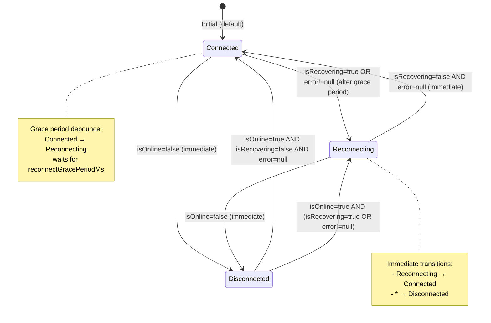
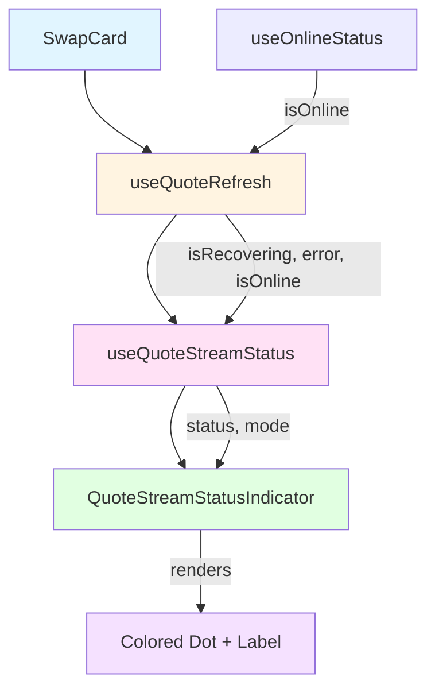

# Design Document: Real-time Connection Status Indicator for Quotes Stream

## Overview

This feature introduces a visual connection status indicator for the quote data stream in the SwapCard UI. The indicator derives its state from existing `useQuoteRefresh` hook outputs (`isRecovering`, `error`, `isOnline`) and displays one of three discrete states: **connected** (green "Live"), **reconnecting** (amber pulsing "Reconnecting"), or **disconnected** (red "Disconnected"). The design prioritizes flicker suppression through a configurable grace-period debounce (default 3000ms) that prevents transient network hiccups from causing distracting UI state changes.

The implementation consists of two primary components:
1. **`useQuoteStreamStatus`**: A pure derivation hook that maps `useQuoteRefresh` outputs to a discrete `ConnectionStatus` type, managing the grace-period timer internally.
2. **`QuoteStreamStatusIndicator`**: A controlled, stateless presentational component that renders the status as a colored dot + text label with full accessibility support.

The feature also supports a `mode` prop (`"stream"` | `"polling"`) to distinguish between real-time WebSocket streams and HTTP polling fallback, rendering different labels and colors accordingly. This design anticipates future WebSocket integration while working with the current polling-based `useQuoteRefresh` implementation.

### Key Design Decisions

- **Pure Derivation Hook**: `useQuoteStreamStatus` is a pure function of its inputs plus elapsed time. Given the same inputs and timer state, it always produces the same output. This makes the hook highly testable and predictable.
- **Single Debounce Timer**: The hook maintains a single timer per grace-period window. Rapid `connected → reconnecting` transitions reset the timer rather than stacking multiple timers, ensuring clean state management.
- **Immediate Offline Transition**: When `isOnline` becomes `false`, the status immediately transitions to `disconnected` without waiting for the grace period. This ensures users are promptly informed of network loss.
- **Immediate Recovery**: When the status recovers from `reconnecting` to `connected`, the transition is immediate (no additional debounce). Only the `connected → reconnecting` transition is debounced.
- **Controlled Component Pattern**: The `QuoteStreamStatusIndicator` is a controlled presentational component with no internal state. All state lives in the hook layer, making the component easy to test and reuse.

---

## Architecture

### Component Hierarchy

```
SwapCard
├── useQuoteRefresh (existing)
│   └── outputs: { isRecovering, error, isOnline, ... }
├── useQuoteStreamStatus (new)
│   ├── inputs: { isRecovering, error, isOnline, mode?, reconnectGracePeriodMs? }
│   └── outputs: { status: ConnectionStatus, mode: Mode }
└── QuoteStreamStatusIndicator (new)
    ├── props: { status, mode, hideWhenConnected? }
    └── renders: colored dot + text label + aria-live region
```

### Data Flow

1. `useQuoteRefresh` tracks quote fetching state and exposes `isRecovering`, `error`, `isOnline`.
2. `useQuoteStreamStatus` consumes these fields and derives a discrete `ConnectionStatus` (`"connected"` | `"reconnecting"` | `"disconnected"`).
3. The hook manages a debounce timer internally: when transitioning from `connected` to `reconnecting`, it waits for the grace period before emitting `"reconnecting"`. If recovery happens before the timer fires, the status remains `"connected"`.
4. `QuoteStreamStatusIndicator` receives `status` and `mode` as props and renders the appropriate visual state with accessibility attributes.
5. `SwapCard` wires the hook to the component, passing the derived status to the indicator.

---

## Components and Interfaces

### 1. `useQuoteStreamStatus` Hook

**Purpose**: Derive a discrete connection status from `useQuoteRefresh` outputs with flicker suppression.

**Type Definitions**:

```typescript
export type ConnectionStatus = "connected" | "reconnecting" | "disconnected";
export type Mode = "stream" | "polling";

export interface UseQuoteStreamStatusOptions {
  /** Debounce window for connected → reconnecting transitions (default 3000ms) */
  reconnectGracePeriodMs?: number;
  /** Data delivery mode: "stream" (WebSocket) or "polling" (HTTP) */
  mode?: Mode;
}

export interface UseQuoteStreamStatusInputs {
  /** True while transient quote failures are being retried */
  isRecovering: boolean;
  /** Current quote fetch error, if any */
  error: Error | null;
  /** Browser network connectivity status */
  isOnline: boolean;
}

export interface UseQuoteStreamStatusResult {
  /** Derived connection status */
  status: ConnectionStatus;
  /** Active data delivery mode */
  mode: Mode;
}
```

**Signature**:

```typescript
export function useQuoteStreamStatus(
  inputs: UseQuoteStreamStatusInputs,
  options?: UseQuoteStreamStatusOptions
): UseQuoteStreamStatusResult;
```

**Derivation Logic** (before debounce):

```typescript
function deriveRawStatus(
  isRecovering: boolean,
  error: Error | null,
  isOnline: boolean
): ConnectionStatus {
  if (!isOnline) return "disconnected";
  if (isRecovering || (error !== null && isOnline)) return "reconnecting";
  return "connected";
}
```

**Debounce Behavior**:

- **`connected → reconnecting`**: Wait for `reconnectGracePeriodMs` before emitting `"reconnecting"`. If recovery happens before the timer fires, cancel the timer and continue emitting `"connected"`.
- **`reconnecting → connected`**: Immediate transition (no debounce).
- **`* → disconnected`**: Immediate transition (no debounce).
- **Timer Reset**: Starting a new `connected → reconnecting` transition while a timer is pending resets the timer.

**Implementation Notes**:

- Use `useRef` to store the timer ID and the last emitted status.
- Use `useEffect` to manage the timer lifecycle based on input changes.
- Use `useState` to track the current wall-clock time (updated every second) for testing staleness.
- Default `mode` to `"polling"` to match the current `useQuoteRefresh` implementation.

---

### 2. `QuoteStreamStatusIndicator` Component

**Purpose**: Render the connection status as a colored dot + text label with full accessibility support.

**Type Definitions**:

```typescript
export interface QuoteStreamStatusIndicatorProps {
  /** Current connection status */
  status: ConnectionStatus;
  /** Data delivery mode */
  mode: Mode;
  /** Hide the indicator when status is "connected" (default false) */
  hideWhenConnected?: boolean;
  /** Additional CSS classes */
  className?: string;
}
```

**Signature**:

```typescript
export function QuoteStreamStatusIndicator(
  props: QuoteStreamStatusIndicatorProps
): JSX.Element | null;
```

**Visual States**:

| Status          | Mode      | Dot Color | Dot Animation | Label                    |
|-----------------|-----------|-----------|---------------|--------------------------|
| `connected`     | `stream`  | Green     | None          | "Live"                   |
| `connected`     | `polling` | Blue      | None          | "Polling"                |
| `reconnecting`  | `stream`  | Amber     | Pulse*        | "Reconnecting"           |
| `reconnecting`  | `polling` | Amber     | Pulse*        | "Reconnecting (polling)" |
| `disconnected`  | (any)     | Red       | None          | "Disconnected"           |

*Pulse animation is disabled when `prefers-reduced-motion: reduce` is active.

**Accessibility Attributes**:

- **`aria-label`**: Root element has `aria-label="Quote stream status: {label}"` (e.g., `"Quote stream status: Live"`).
- **`aria-live`**:
  - `"polite"` for `connected` and `reconnecting` states.
  - `"assertive"` for `disconnected` state (critical information).
- **`aria-hidden="true"`**: The decorative dot element is hidden from screen readers.
- **Text Label**: Always present alongside the dot to ensure color is not the sole means of conveying status.

**Conditional Rendering**:

- If `hideWhenConnected` is `true` and `status` is `"connected"`, return `null` (no visible element).

**Implementation Notes**:

- Use Tailwind CSS for styling (consistent with existing SwapCard components).
- Use `window.matchMedia('(prefers-reduced-motion: reduce)')` to detect reduced motion preference.
- Render the dot as a `<span>` with `aria-hidden="true"` and the label as a `<span>` with the status text.
- Wrap the component in a `<div>` with the `aria-label` and `aria-live` attributes.

---

## Data Models

### `ConnectionStatus` Type

```typescript
export type ConnectionStatus = "connected" | "reconnecting" | "disconnected";
```

A discrete enumeration representing the health of the quote data channel:

- **`"connected"`**: Quote data is flowing normally. No errors, not recovering, and online.
- **`"reconnecting"`**: Quote data is temporarily unavailable due to transient errors or recovery attempts. The system is actively retrying.
- **`"disconnected"`**: The browser is offline. No quote data can be fetched until network connectivity is restored.

### `Mode` Type

```typescript
export type Mode = "stream" | "polling";
```

Represents the active data-delivery mechanism:

- **`"stream"`**: Real-time WebSocket connection (future).
- **`"polling"`**: HTTP polling via `GET /api/v1/quote` (current).

---

## Correctness Properties

*A property is a characteristic or behavior that should hold true across all valid executions of a system—essentially, a formal statement about what the system should do. Properties serve as the bridge between human-readable specifications and machine-verifiable correctness guarantees.*

### Property Reflection

After analyzing all acceptance criteria, I identified the following properties. I then performed a reflection to eliminate redundancy:

**Redundancy Analysis**:
- Properties 1.1, 1.2, 1.3 (derivation rules) are combined into Property 1 (status derivation correctness).
- Property 1.8 (meta-property) is subsumed by Property 1 after timer resolution.
- Properties 1.4 and 1.5 (debounce behavior) are combined into Property 2 (flicker suppression).
- Property 4.1 is redundant with Property 2 (both express flicker suppression).
- Property 4.3 is redundant with Property 3 (immediate offline transition).
- Property 5.1, 5.5, 5.6 (accessibility attributes) are combined into Property 6 (accessibility completeness).

**Final Properties** (after removing redundancy):

### Property 1: Status Derivation Correctness

*For any* combination of `isRecovering`, `error`, and `isOnline` inputs, after any pending grace-period timer resolves, the emitted `ConnectionStatus` SHALL be:
- `"connected"` when `isRecovering` is `false`, `error` is `null`, and `isOnline` is `true`
- `"reconnecting"` when `isRecovering` is `true` OR (`error` is non-null AND `isOnline` is `true`)
- `"disconnected"` when `isOnline` is `false`

**Validates: Requirements 1.1, 1.2, 1.3, 1.8**

### Property 2: Flicker Suppression (Grace Period Debounce)

*For any* `reconnectGracePeriodMs` value and any sequence of input changes, when the derived status would transition from `"connected"` to `"reconnecting"` and then back to `"connected"` within the grace period, the emitted status SHALL remain `"connected"` throughout (i.e., `"reconnecting"` SHALL never be emitted during that window).

**Validates: Requirements 1.4, 1.5, 4.1**

### Property 3: Immediate Offline Transition

*For any* prior connection status (`"connected"` or `"reconnecting"`), when `isOnline` transitions to `false`, the emitted status SHALL immediately become `"disconnected"` without waiting for the grace period.

**Validates: Requirements 1.7, 4.3**

### Property 4: Immediate Recovery Transition

*For any* `"reconnecting"` state (after the grace period has elapsed), when the inputs change such that the derived status becomes `"connected"`, the emitted status SHALL update immediately without an additional debounce delay.

**Validates: Requirements 4.2**

### Property 5: Single Timer Per Grace Period

*For any* number of rapid `connected → reconnecting` transitions within a grace period window, the hook SHALL maintain only one active debounce timer, and SHALL reset the timer on each new transition rather than stacking multiple timers.

**Validates: Requirements 4.4**

### Property 6: Accessibility Completeness

*For any* valid `(status, mode)` combination, the rendered `QuoteStreamStatusIndicator` SHALL include:
- An `aria-label` containing the full status description
- A non-empty text label visible to all users
- `aria-hidden="true"` on the decorative dot element

**Validates: Requirements 5.1, 5.5, 5.6**

### Property 7: Mode Change Immediacy

*For any* prior connection status, when the `mode` input changes from `"stream"` to `"polling"` (or vice versa), the emitted `mode` value SHALL immediately reflect the change without waiting for the grace period.

**Validates: Requirements 3.5**

### Property 8: Hook Determinism (Purity)

*For any* set of inputs `(isRecovering, error, isOnline, reconnectGracePeriodMs)` and elapsed time `t`, calling the status derivation logic twice with the same inputs and elapsed time SHALL produce the same `ConnectionStatus` output.

**Validates: Requirements 6.2**

---

## Error Handling

### Input Validation

- **Invalid `reconnectGracePeriodMs`**: If the provided value is not a positive number, default to 3000ms and log a warning to the console.
- **Invalid `mode`**: If the provided value is not `"stream"` or `"polling"`, default to `"polling"` and log a warning.
- **Undefined Inputs**: If `isRecovering`, `error`, or `isOnline` are `undefined`, treat them as their "safe" defaults:
  - `isRecovering`: `false`
  - `error`: `null`
  - `isOnline`: `true`
  
  This ensures the hook emits `"connected"` as the default status when `useQuoteRefresh` is not yet mounted or has no valid inputs (Requirement 6.3).

### Error States

- **Network Offline**: When `isOnline` is `false`, the status is `"disconnected"`. The indicator renders a red dot and "Disconnected" label. No additional error handling is needed—the user is already informed via the visual state.
- **Transient Errors**: When `error` is non-null and `isOnline` is `true`, the status is `"reconnecting"`. The indicator renders an amber pulsing dot and "Reconnecting" label. The `useQuoteRefresh` hook handles retries; the status indicator simply reflects the current state.
- **Persistent Errors**: If `useQuoteRefresh` exhausts its retry attempts and `isRecovering` becomes `false` while `error` is still non-null, the status remains `"reconnecting"` (per the derivation logic). This is intentional: the indicator shows that the connection is unhealthy, even if retries have stopped. The user can manually refresh via the existing refresh button.

### Edge Cases

- **Rapid State Changes**: The debounce timer ensures that rapid `connected → reconnecting → connected` cycles do not cause flicker. If the user's network is unstable and oscillates frequently, the indicator will show `"reconnecting"` only after the grace period elapses, reducing visual noise.
- **Timer Cleanup**: The hook must clean up the debounce timer on unmount or when inputs change. Use `useEffect` cleanup functions to ensure no memory leaks.
- **SSR/Hydration**: The hook uses `useEffect` for timer management, so it will not run on the server. The initial render will emit the default status (`"connected"`), and the client-side effect will update the status after hydration. This is acceptable because the status indicator is not critical for initial page load.

---

## Testing Strategy

This feature uses a **dual testing approach** combining example-based unit tests and property-based tests:

### Unit Tests (Vitest + @testing-library/react)

Unit tests verify specific examples, edge cases, and integration points:

**Hook Tests** (`useQuoteStreamStatus.test.ts`):
- Default behavior: hook emits `"connected"` when inputs are undefined (Requirement 6.3)
- Default grace period: hook uses 3000ms when `reconnectGracePeriodMs` is not provided (Requirement 1.6)
- Default mode: hook emits `mode: "polling"` when `mode` is not provided (Requirement 3.4)
- Immediate offline transition: status becomes `"disconnected"` immediately when `isOnline` becomes `false` (example for Property 3)
- Immediate recovery: status becomes `"connected"` immediately when recovering from `"reconnecting"` (example for Property 4)
- Timer cleanup: timer is cleaned up on unmount

**Component Tests** (`QuoteStreamStatusIndicator.test.tsx`):
- Renders green dot + "Live" label when `status="connected"` and `mode="stream"` (Requirement 2.1)
- Renders blue dot + "Polling" label when `status="connected"` and `mode="polling"` (Requirement 3.2)
- Renders amber dot + "Reconnecting" label when `status="reconnecting"` and `mode="stream"` (Requirement 2.2)
- Renders amber dot + "Reconnecting (polling)" label when `status="reconnecting"` and `mode="polling"` (Requirement 3.3)
- Renders red dot + "Disconnected" label when `status="disconnected"` (Requirement 2.3)
- Hides when `hideWhenConnected={true}` and `status="connected"` (Requirement 2.5)
- Applies pulse animation when `status="reconnecting"` and `prefers-reduced-motion` is false (Requirement 2.6)
- Removes pulse animation when `prefers-reduced-motion: reduce` is active (Requirement 2.7)
- Renders `aria-live="polite"` when `status="reconnecting"` (Requirement 5.2)
- Renders `aria-live="assertive"` when `status="disconnected"` (Requirement 5.3)
- Renders `aria-live="polite"` when `status="connected"` (Requirement 5.4)

**Integration Tests** (`SwapCard.test.tsx`):
- SwapCard renders `QuoteStreamStatusIndicator` in the header row (Requirement 2.4)
- SwapCard wires `useQuoteStreamStatus` to `useQuoteRefresh` output (Requirement 6.5)

### Property-Based Tests (fast-check)

Property-based tests verify universal properties across many generated inputs. Each property test runs a minimum of **100 iterations** to ensure comprehensive coverage.

**Property Test Configuration**:
- Library: `fast-check` (already in `devDependencies`)
- Iterations: 100 per property test
- Tag format: `// Feature: quote-stream-status, Property {number}: {property_text}`

**Property Tests** (`useQuoteStreamStatus.property.test.ts`):

1. **Property 1: Status Derivation Correctness**
   ```typescript
   // Feature: quote-stream-status, Property 1: Status derivation correctness
   fc.assert(
     fc.property(
       fc.boolean(), // isRecovering
       fc.option(fc.constantFrom(new Error("test")), { nil: null }), // error
       fc.boolean(), // isOnline
       fc.nat({ max: 10000 }), // gracePeriodMs
       (isRecovering, error, isOnline, gracePeriodMs) => {
         // Render hook, advance timers past grace period, verify status matches derivation rules
       }
     ),
     { numRuns: 100 }
   );
   ```

2. **Property 2: Flicker Suppression**
   ```typescript
   // Feature: quote-stream-status, Property 2: Flicker suppression
   fc.assert(
     fc.property(
       fc.nat({ max: 5000 }), // gracePeriodMs
       fc.nat({ max: 4999 }), // recoveryDelayMs (< gracePeriodMs)
       (gracePeriodMs, recoveryDelayMs) => {
         // Transition to reconnecting, recover before grace period, verify "reconnecting" never emitted
       }
     ),
     { numRuns: 100 }
   );
   ```

3. **Property 3: Immediate Offline Transition**
   ```typescript
   // Feature: quote-stream-status, Property 3: Immediate offline transition
   fc.assert(
     fc.property(
       fc.constantFrom("connected", "reconnecting"), // prior status
       (priorStatus) => {
         // Set up prior status, set isOnline=false, verify immediate "disconnected"
       }
     ),
     { numRuns: 100 }
   );
   ```

4. **Property 4: Immediate Recovery Transition**
   ```typescript
   // Feature: quote-stream-status, Property 4: Immediate recovery transition
   fc.assert(
     fc.property(
       fc.nat({ max: 10000 }), // gracePeriodMs
       (gracePeriodMs) => {
         // Set up reconnecting state (after grace period), recover, verify immediate "connected"
       }
     ),
     { numRuns: 100 }
   );
   ```

5. **Property 5: Single Timer Per Grace Period**
   ```typescript
   // Feature: quote-stream-status, Property 5: Single timer per grace period
   fc.assert(
     fc.property(
       fc.nat({ min: 2, max: 10 }), // number of rapid transitions
       fc.nat({ max: 5000 }), // gracePeriodMs
       (numTransitions, gracePeriodMs) => {
         // Trigger numTransitions rapid connected→reconnecting transitions, verify only one timer fires
       }
     ),
     { numRuns: 100 }
   );
   ```

6. **Property 6: Accessibility Completeness**
   ```typescript
   // Feature: quote-stream-status, Property 6: Accessibility completeness
   fc.assert(
     fc.property(
       fc.constantFrom("connected", "reconnecting", "disconnected"), // status
       fc.constantFrom("stream", "polling"), // mode
       (status, mode) => {
         // Render component, verify aria-label, text label, and aria-hidden on dot
       }
     ),
     { numRuns: 100 }
   );
   ```

7. **Property 7: Mode Change Immediacy**
   ```typescript
   // Feature: quote-stream-status, Property 7: Mode change immediacy
   fc.assert(
     fc.property(
       fc.constantFrom("connected", "reconnecting"), // prior status
       fc.constantFrom("stream", "polling"), // initial mode
       (priorStatus, initialMode) => {
         // Set up prior status, change mode, verify immediate mode reflection
       }
     ),
     { numRuns: 100 }
   );
   ```

8. **Property 8: Hook Determinism**
   ```typescript
   // Feature: quote-stream-status, Property 8: Hook determinism
   fc.assert(
     fc.property(
       fc.boolean(), // isRecovering
       fc.option(fc.constantFrom(new Error("test")), { nil: null }), // error
       fc.boolean(), // isOnline
       fc.nat({ max: 10000 }), // gracePeriodMs
       fc.nat({ max: 10000 }), // elapsed time
       (isRecovering, error, isOnline, gracePeriodMs, elapsed) => {
         // Call derivation logic twice with same inputs, verify same output
       }
     ),
     { numRuns: 100 }
   );
   ```

### Test Utilities

**Timer Mocking**:
- Use `vi.useFakeTimers()` to control time in tests.
- Use `vi.advanceTimersByTime(ms)` to advance the debounce timer.
- Use `vi.useRealTimers()` in `afterEach` to restore real timers.

**Media Query Mocking**:
- Mock `window.matchMedia` in `vitest.setup.ts` (already done for `prefers-reduced-motion`).
- Override the mock in specific tests to return `matches: true` for reduced motion tests.

**Hook Testing**:
- Use `@testing-library/react`'s `renderHook` to test hooks in isolation.
- Use `act` to wrap state updates and timer advancements.
- Use `waitFor` to wait for async state updates.

---

## Implementation Plan

### Phase 1: Hook Implementation

1. Create `frontend/hooks/useQuoteStreamStatus.ts`:
   - Define types: `ConnectionStatus`, `Mode`, `UseQuoteStreamStatusOptions`, `UseQuoteStreamStatusInputs`, `UseQuoteStreamStatusResult`.
   - Implement `deriveRawStatus` helper function.
   - Implement `useQuoteStreamStatus` hook with debounce timer logic.
   - Handle default values: `reconnectGracePeriodMs` defaults to 3000, `mode` defaults to `"polling"`.
   - Handle undefined inputs: default to safe values (`isRecovering: false`, `error: null`, `isOnline: true`).

2. Create `frontend/hooks/useQuoteStreamStatus.test.ts`:
   - Write unit tests for default behavior, immediate transitions, and timer cleanup.

3. Create `frontend/hooks/useQuoteStreamStatus.property.test.ts`:
   - Write property-based tests for Properties 1–5, 7–8 using `fast-check`.

### Phase 2: Component Implementation

1. Create `frontend/components/swap/QuoteStreamStatusIndicator.tsx`:
   - Define `QuoteStreamStatusIndicatorProps` interface.
   - Implement component with conditional rendering based on `status` and `mode`.
   - Add accessibility attributes: `aria-label`, `aria-live`, `aria-hidden`.
   - Add `prefers-reduced-motion` detection and conditional pulse animation.
   - Use Tailwind CSS for styling (match existing SwapCard component patterns).

2. Create `frontend/components/swap/QuoteStreamStatusIndicator.test.tsx`:
   - Write unit tests for all visual states, accessibility attributes, and conditional rendering.

3. Create `frontend/components/swap/QuoteStreamStatusIndicator.property.test.ts`:
   - Write property-based test for Property 6 (accessibility completeness).

### Phase 3: Integration

1. Update `frontend/components/swap/SwapCard.tsx`:
   - Import `useQuoteStreamStatus` and `QuoteStreamStatusIndicator`.
   - Wire `useQuoteStreamStatus` to `useQuoteRefresh` output.
   - Render `QuoteStreamStatusIndicator` in the header row, adjacent to the refresh button.

2. Update `frontend/components/swap/SwapCard.test.tsx`:
   - Add integration tests to verify the indicator is rendered and wired correctly.

### Phase 4: Documentation and Polish

1. Add JSDoc comments to `useQuoteStreamStatus` and `QuoteStreamStatusIndicator`.
2. Update `frontend/components/swap/README.md` to document the new indicator component.
3. Run all tests and ensure 100% pass rate.
4. Run linter and formatter (`npm run lint`, `npm run format`).
5. Verify accessibility with manual screen reader testing (NVDA/JAWS on Windows, VoiceOver on macOS).

---

## Future Enhancements

### WebSocket Integration

When the backend exposes a WebSocket endpoint for real-time quote streams:

1. Update `useQuoteRefresh` to accept a `mode` option (`"stream"` | `"polling"`).
2. When `mode` is `"stream"`, subscribe to the WebSocket and update `data` from pushed payloads.
3. Set `isRecovering` to `true` when the WebSocket connection is lost and retrying.
4. Pass `mode: "stream"` to `useQuoteStreamStatus` when the WebSocket is active.
5. The indicator will automatically render "Live" (green) when connected via WebSocket.

### Customizable Grace Period

Expose the `reconnectGracePeriodMs` option in the SwapCard settings panel, allowing users to customize the flicker suppression window based on their network conditions.

### Connection Quality Metrics

Extend the indicator to show connection quality (e.g., "Good", "Fair", "Poor") based on retry frequency or latency. This would require additional metrics from `useQuoteRefresh`.

---

## Appendix: Mermaid Diagrams

### State Transition Diagram



### Component Integration Diagram


