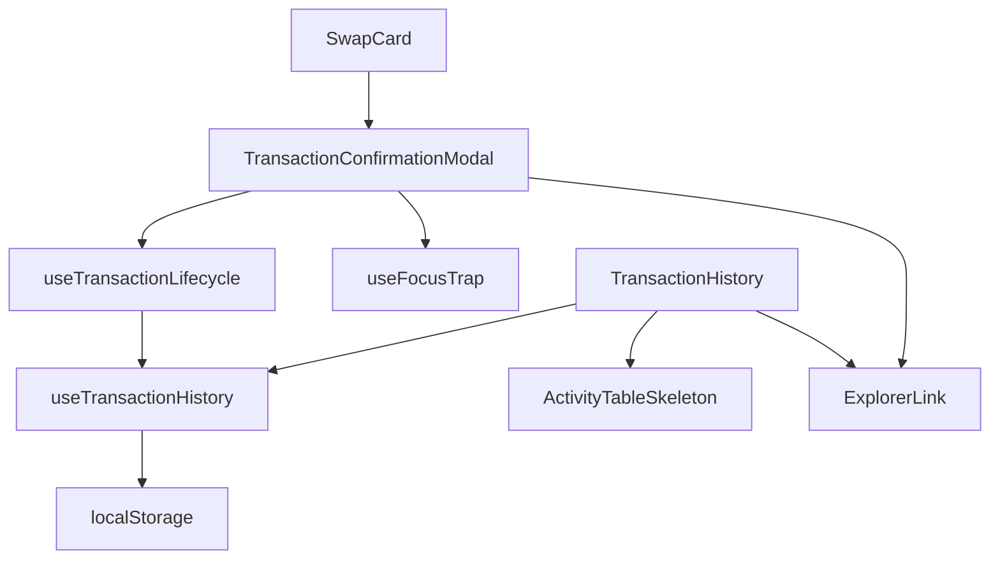
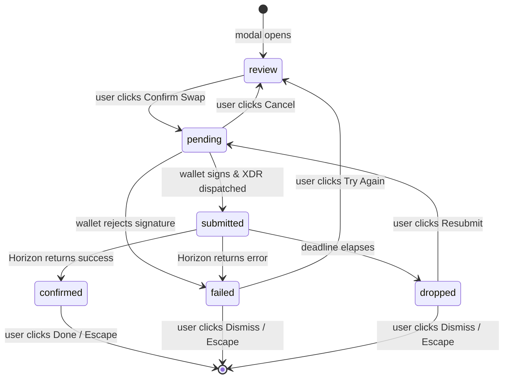
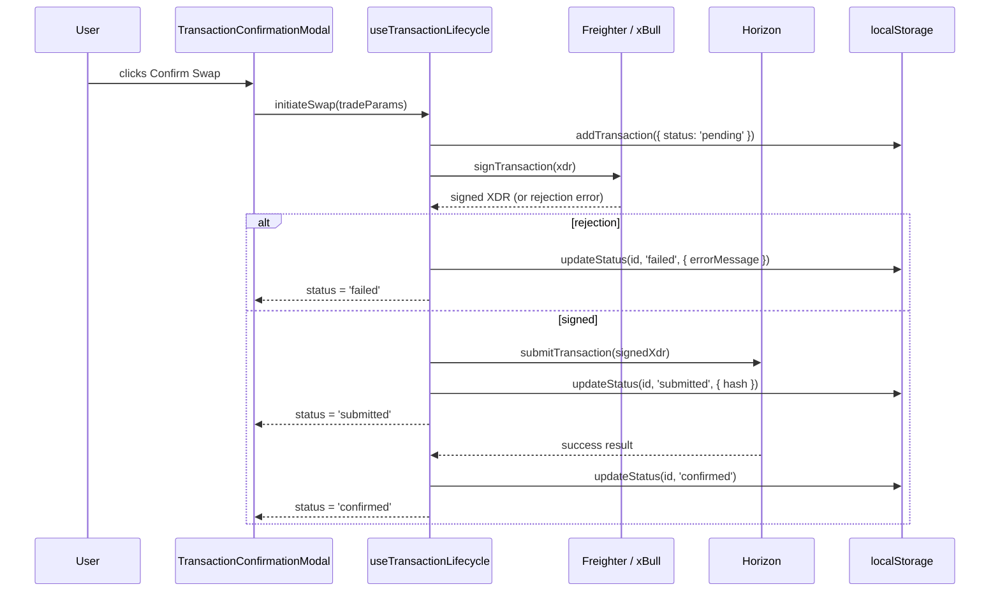

# Design Document

## Wallet Transaction Lifecycle UX

---

## Overview

This design standardises the full lifecycle UX for swap transactions in StellarRoute. The work touches two surfaces — the `TransactionConfirmationModal` (the step-by-step modal that guides a user from trade review through terminal outcome) and the `TransactionHistory` / Activity View (the table that lists past and in-flight transactions).

The current codebase has a `TransactionStatus` union type with five values (`pending`, `submitting`, `processing`, `success`, `failed`) that do not map cleanly to the five states required by the spec (`pending`, `submitted`, `confirmed`, `failed`, `dropped`). The modal handles `pending`, `submitting`/`processing`, `success`, and `failed` but has no `dropped` state, no per-state recovery actions beyond a single "Dismiss" on failure, no focus management, no Escape-key blocking during in-flight states, and no focus trap. The `useTransactionHistory` hook persists records but does not downgrade in-flight states on reload.

This design resolves all of those gaps with minimal structural disruption: the type is renamed/remapped, the modal gains a state machine, a `useFocusTrap` hook is introduced, and the history hook gains a reload-time downgrade pass.

---

## Architecture

### Component Topology



### State Machine

The modal is driven by a finite state machine. The `review` pseudo-state is not part of `TransactionStatus` (it is a UI-only state that precedes the lifecycle) and is kept as a separate discriminant in the modal's local state.



### Data Flow



---

## Components and Interfaces

### 1. `TransactionStatus` type (updated)

Located in `frontend/types/transaction.ts`.

```typescript
export type TransactionStatus =
  | 'pending'    // wallet prompt shown, awaiting signature
  | 'submitted'  // signed XDR dispatched to Horizon
  | 'confirmed'  // Horizon returned success
  | 'failed'     // Horizon error OR wallet rejection
  | 'dropped';   // deadline elapsed without on-chain inclusion
```

The old values `submitting`, `processing`, and `success` are removed. Any existing code referencing them is updated as part of this feature.

### 2. `TransactionRecord` type (updated)

The `status` field now uses the new `TransactionStatus`. No other field changes are required; the existing fields (`hash`, `errorMessage`, `timestamp`, `fromAsset`, `toAsset`, `fromAmount`, `toAmount`, `walletAddress`) already cover all persistence needs.

### 3. `TransactionConfirmationModal` (refactored)

Located in `frontend/components/shared/TransactionConfirmationModal.tsx`.

**Props interface** (additions / changes only):

```typescript
interface TransactionConfirmationModalProps {
  // ... existing props unchanged ...
  status: TransactionStatus | 'review';   // 'review' is the pre-lifecycle UI state
  txHash?: string;
  errorMessage?: string;
  // New callbacks for recovery actions
  onTryAgain: () => void;    // failed → review (pre-populated)
  onResubmit: () => void;    // dropped → pending
  onDismiss: () => void;     // failed/dropped → close modal
  onCancel: () => void;      // pending → review (abort signing)
  onDone: () => void;        // confirmed → close modal
}
```

**Focus targets per state** (managed internally via `useEffect` + `ref`):

| State       | Focus target                        |
|-------------|-------------------------------------|
| `review`    | "Confirm Swap" button               |
| `pending`   | "Cancel" button                     |
| `submitted` | Modal container (`tabIndex={-1}`)   |
| `confirmed` | "Done" button                       |
| `failed`    | "Try Again" button                  |
| `dropped`   | "Resubmit" button                   |

**Escape key behaviour**:

- `review`, `confirmed`, `failed`, `dropped` → close modal (existing `onOpenChange` behaviour).
- `pending`, `submitted` → suppress close; announce via `aria-live` region: *"Transaction in progress. Use the Cancel button to abort."*

**Accessibility attributes**:

- `aria-live="polite"` region inside the modal for state-change announcements.
- `aria-describedby` pointing to a visually-hidden `<p>` that describes the current state in plain language.
- Focus trap active while modal is open (see `useFocusTrap` below).

### 4. `useFocusTrap` hook (new)

Located in `frontend/hooks/useFocusTrap.ts`.

```typescript
function useFocusTrap(
  containerRef: React.RefObject<HTMLElement>,
  active: boolean
): void
```

Queries all focusable descendants (`a[href], button:not([disabled]), input, select, textarea, [tabindex]:not([tabindex="-1"])`) and intercepts `Tab` / `Shift+Tab` to cycle within them. Activates only when `active` is `true` (i.e., the modal is open).

### 5. `useTransactionLifecycle` hook (new)

Located in `frontend/hooks/useTransactionLifecycle.ts`.

Encapsulates the full swap execution flow so the modal stays presentational:

```typescript
interface UseTransactionLifecycleResult {
  status: TransactionStatus | 'review';
  txHash: string | undefined;
  errorMessage: string | undefined;
  tradeParams: TradeParams | undefined;
  initiateSwap: (params: TradeParams) => Promise<void>;
  cancel: () => void;
  resubmit: () => Promise<void>;
  tryAgain: () => void;
  dismiss: () => void;
}
```

Internally calls `useWallet` for signing and `useTransactionHistory` for persistence. Manages a deadline timer (configurable, default 60 s) that fires the `dropped` transition if Horizon has not responded.

### 6. `ExplorerLink` component (new)

Located in `frontend/components/shared/ExplorerLink.tsx`.

```typescript
interface ExplorerLinkProps {
  hash: string;
  className?: string;
}
```

Renders:
```html
<a
  href="https://stellar.expert/explorer/public/tx/{hash}"
  target="_blank"
  rel="noreferrer noopener"
  aria-label="View transaction {shortHash} on Stellar Expert"
>
  View on Stellar Expert <ExternalLink />
</a>
```

Used by both the modal and the Activity View. When `hash` is empty/undefined the component renders nothing (callers are responsible for conditional rendering, but the component itself also guards against empty strings).

### 7. `useTransactionHistory` hook (updated)

The reload-time downgrade logic is added to the initialisation path:

```typescript
function downgradePendingOnReload(records: TransactionRecord[]): TransactionRecord[] {
  return records.map(tx =>
    tx.status === 'pending' || tx.status === 'submitted'
      ? { ...tx, status: 'dropped' as TransactionStatus }
      : tx
  );
}
```

This pure function is applied when records are first read from `localStorage` (both in the lazy initialiser and in the `walletAddress`-change effect).

### 8. `TransactionHistory` / Activity View (updated)

Changes:

- `getStatusBadge` updated to handle all five `TransactionStatus` values with distinct visual styles.
- Explorer column: renders `<ExplorerLink>` when `tx.hash` is non-empty; renders `<span>` dash otherwise.
- Retry column: renders a `<button>` with `aria-label="Retry {fromAsset}→{toAsset} swap from {date}"` for rows with `status === 'failed' || status === 'dropped'`.
- Skeleton: `aria-busy="true"` and `aria-label="Loading transaction history"` added to the table container during loading.
- Each status badge gains `aria-label="Status: {status}"`.
- Each `ExplorerLink` in the table uses `aria-label="View transaction {shortHash} on Stellar Expert"`.

---

## Data Models

### `TransactionRecord` (complete, post-change)

```typescript
export interface TransactionRecord {
  id: string;
  timestamp: number;

  // Trade details
  fromAsset: string;
  fromAmount: string;
  fromIcon?: string;
  toAsset: string;
  toAmount: string;
  toIcon?: string;

  // Swap parameters
  exchangeRate: string;
  priceImpact: string;
  minReceived: string;
  networkFee: string;
  routePath: PathStep[];

  // Lifecycle state
  status: TransactionStatus;   // 'pending' | 'submitted' | 'confirmed' | 'failed' | 'dropped'

  // Results / errors
  hash?: string;
  errorMessage?: string;

  // Ownership
  walletAddress: string;
}
```

### localStorage schema

Key: `stellar_route_tx_history_{walletAddress}`  
Value: `JSON.stringify(TransactionRecord[])`

The serialisation is a plain `JSON.stringify` / `JSON.parse` round-trip. All fields are JSON-safe primitives or arrays of primitives. No migration is needed for the status rename because the downgrade pass already handles unknown/stale statuses gracefully (any value that is not one of the five canonical statuses will be left as-is and rendered by the badge's `default` branch).

---

## Correctness Properties

*A property is a characteristic or behavior that should hold true across all valid executions of a system — essentially, a formal statement about what the system should do. Properties serve as the bridge between human-readable specifications and machine-verifiable correctness guarantees.*

### Property 1: localStorage round-trip preserves all record fields

*For any* `TransactionRecord` with any combination of field values (including optional fields), serialising it to JSON and deserialising it back must produce a record that is deeply equal to the original, with all fields — `status`, `hash`, `errorMessage`, `timestamp`, `fromAsset`, `toAsset`, `fromAmount`, `toAmount` — preserved exactly.

**Validates: Requirements 6.4**

---

### Property 2: Reload downgrades in-flight statuses to `dropped`

*For any* array of `TransactionRecord` objects with arbitrary statuses, applying `downgradePendingOnReload` must produce an array where every record that had `status === 'pending'` or `status === 'submitted'` now has `status === 'dropped'`, and every record that had any other status is unchanged.

**Validates: Requirements 6.3**

---

### Property 3: Status badge renders a non-empty accessible label for every valid status

*For any* `TransactionStatus` value drawn from the five-element enum, rendering the status badge must produce a DOM element whose `aria-label` attribute is exactly `"Status: {status}"` and whose visible text is non-empty.

**Validates: Requirements 1.7, 5.4**

---

### Property 4: ExplorerLink URL is well-formed for any non-empty hash

*For any* non-empty transaction hash string, the `ExplorerLink` component must render an `<a>` element whose `href` is exactly `https://stellar.expert/explorer/public/tx/{hash}`, with `target="_blank"` and `rel` containing both `"noreferrer"` and `"noopener"`.

**Validates: Requirements 3.3, 3.6**

---

### Property 5: Recovery actions and Retry buttons are present for every non-success terminal state

*For any* modal render where `status` is `'failed'` or `'dropped'`, the rendered output must contain both a primary recovery action ("Try Again" for `failed`, "Resubmit" for `dropped`) and a "Dismiss" action. *For any* modal render where `status` is `'pending'`, the rendered output must contain a "Cancel" action. *For any* `TransactionRecord` with `status === 'failed'` or `status === 'dropped'` rendered in the Activity View, a "Retry" button must be present whose `aria-label` contains the record's `fromAsset`, `toAsset`, and a date string derived from `timestamp`.

**Validates: Requirements 2.1, 2.2, 2.3, 2.4, 2.5, 2.7, 5.2**

---

### Property 6: Escape key closes the modal only in non-in-flight states

*For any* modal `status` drawn from `{'review', 'confirmed', 'failed', 'dropped'}`, pressing the Escape key must invoke `onOpenChange(false)`. *For any* modal `status` drawn from `{'pending', 'submitted'}`, pressing the Escape key must NOT invoke `onOpenChange(false)` and must instead trigger an announcement in the `aria-live` region.

**Validates: Requirements 4.8, 4.9**

---

### Property 7: Focus trap keeps Tab cycling within the modal

*For any* set of focusable elements rendered inside the modal container, pressing Tab from the last focusable element must move focus to the first focusable element, and pressing Shift+Tab from the first must move focus to the last — never escaping the container.

**Validates: Requirements 4.7**

---

### Property 8: Modal aria-describedby points to a non-empty description for every state

*For any* modal status value (including `'review'`), the modal's root element must have an `aria-describedby` attribute that references a non-empty element containing a plain-language description of the current state.

**Validates: Requirements 4.10**

---

### Property 9: Activity View ExplorerLink aria-label encodes the short hash

*For any* `TransactionRecord` with a non-empty `hash`, the `<a>` element rendered in the Activity View's Explorer column must have `aria-label` equal to `"View transaction {hash.slice(0, 8)} on Stellar Expert"`.

**Validates: Requirements 5.3**

---

### Property 10: Persistence round-trip — write then reload restores all records

*For any* array of `TransactionRecord` objects, writing them to `localStorage` via `useTransactionHistory` and then re-initialising the hook (simulating a page reload) must restore all records, with `pending` and `submitted` records downgraded to `dropped` and all other records unchanged.

**Validates: Requirements 6.1, 6.2, 6.3**

---

## Error Handling

### Wallet rejection during `pending`

When the wallet extension returns a rejection error (message contains "reject", "denied", or "user declined"), `useTransactionLifecycle` transitions to `failed` with `errorMessage = "Signature rejected. You can try again or dismiss."` (Requirement 2.6).

### Horizon submission error

Any non-2xx response from Horizon during submission transitions to `failed`. The `errorMessage` is extracted from the Horizon error envelope (`extras.result_codes` if present, otherwise the top-level `title`).

### Deadline elapsed (`dropped`)

A `setTimeout` of configurable duration (default 60 s, overridable via a `deadlineMs` prop on `useTransactionLifecycle`) fires the `dropped` transition if the hook is still in `submitted` state. The timer is cleared on any earlier terminal transition.

### localStorage write failure

`useTransactionHistory` wraps every `localStorage.setItem` call in a try/catch. On failure it logs a console error but does not surface an error to the user (the in-memory state remains correct for the current session).

### Focus management failure

If a target ref is null when a state transition fires (e.g., the button has not yet mounted), the `useEffect` that calls `.focus()` is a no-op. This is safe because React's commit order guarantees the ref will be populated before the effect runs in normal circumstances.

---

## Testing Strategy

### Unit tests (Vitest + @testing-library/react)

- `TransactionConfirmationModal`: one test per state verifying the correct heading, action buttons, and `aria-label` values are rendered.
- `TransactionConfirmationModal` Escape key: verify that `onOpenChange(false)` is called in `review`/`confirmed`/`failed`/`dropped` states and is NOT called in `pending`/`submitted` states.
- `ExplorerLink`: verify URL construction, `rel` attribute, and `aria-label` for a concrete hash; verify nothing is rendered for an empty hash.
- `useTransactionHistory` — `downgradePendingOnReload`: example-based tests for each status value.
- `TransactionHistory` skeleton: verify `aria-busy="true"` and `aria-label` are present during loading.
- `useFocusTrap`: verify Tab cycles within the container and does not escape.

### Property-based tests (fast-check, Vitest)

The project already has `fast-check@3.22.0` in `devDependencies`. Each property test runs a minimum of 100 iterations. Tag format: `// Feature: wallet-transaction-lifecycle, Property {N}: {title}`.

**Property 1 — localStorage round-trip** (`Feature: wallet-transaction-lifecycle, Property 1: localStorage round-trip preserves all record fields`):  
Generate arbitrary `TransactionRecord` objects using `fc.record` with `fc.constantFrom(...statuses)` for the status field and `fc.option(fc.string())` for optional fields. Serialise with `JSON.stringify`, deserialise with `JSON.parse`, assert deep equality.

**Property 2 — Reload downgrade** (`Feature: wallet-transaction-lifecycle, Property 2: Reload downgrades in-flight statuses to dropped`):  
Generate arbitrary arrays of `TransactionRecord` objects with random statuses using `fc.array(fc.record(...))`. Apply `downgradePendingOnReload`. Assert all previously-pending/submitted records are now `dropped` and all others are unchanged.

**Property 3 — Status badge aria-label** (`Feature: wallet-transaction-lifecycle, Property 3: Status badge renders a non-empty accessible label for every valid status`):  
Generate arbitrary `TransactionStatus` values using `fc.constantFrom('pending', 'submitted', 'confirmed', 'failed', 'dropped')`. Render the badge. Assert `aria-label === "Status: {status}"`.

**Property 4 — ExplorerLink URL** (`Feature: wallet-transaction-lifecycle, Property 4: ExplorerLink URL is well-formed for any non-empty hash`):  
Generate arbitrary non-empty hash strings using `fc.stringOf(fc.char(), { minLength: 1, maxLength: 64 })`. Render `<ExplorerLink hash={hash} />`. Assert `href`, `target="_blank"`, and `rel` contains `"noreferrer"` and `"noopener"`.

**Property 5 — Recovery actions and Retry buttons** (`Feature: wallet-transaction-lifecycle, Property 5: Recovery actions and Retry buttons are present for every non-success terminal state`):  
Generate arbitrary `status` values from `['failed', 'dropped', 'pending']` and arbitrary `TransactionRecord` objects. Render the modal and Activity View row. Assert the correct action buttons are present with correct `aria-label` values.

**Property 6 — Escape key behaviour** (`Feature: wallet-transaction-lifecycle, Property 6: Escape key closes the modal only in non-in-flight states`):  
Generate arbitrary status values from the six modal states. Fire a keyboard Escape event. Assert `onOpenChange(false)` is called for closeable states and not called for in-flight states.

**Property 7 — Focus trap** (`Feature: wallet-transaction-lifecycle, Property 7: Focus trap keeps Tab cycling within the modal`):  
Generate arbitrary counts of focusable elements (1–10) inside a container. Activate the focus trap. Press Tab N times. Assert focus never leaves the container and cycles correctly.

**Property 8 — aria-describedby** (`Feature: wallet-transaction-lifecycle, Property 8: Modal aria-describedby points to a non-empty description for every state`):  
Generate arbitrary modal status values. Render the modal. Assert `aria-describedby` is set and the referenced element has non-empty text content.

**Property 9 — Activity View ExplorerLink aria-label** (`Feature: wallet-transaction-lifecycle, Property 9: Activity View ExplorerLink aria-label encodes the short hash`):  
Generate arbitrary non-empty hash strings. Render an Activity View row with that hash. Assert `aria-label === "View transaction {hash.slice(0, 8)} on Stellar Expert"`.

**Property 10 — Persistence round-trip** (`Feature: wallet-transaction-lifecycle, Property 10: Persistence round-trip — write then reload restores all records`):  
Generate arbitrary arrays of `TransactionRecord` objects with mixed statuses. Write via `addTransaction`. Re-initialise the hook. Assert all records are restored with correct downgrade applied.

### Integration / accessibility

- Playwright E2E smoke test: open the swap flow, confirm a swap, verify the modal transitions through `pending → submitted → confirmed` and the "Done" button is focusable.
- `@axe-core/playwright` accessibility scan on the modal in each of the five lifecycle states.
