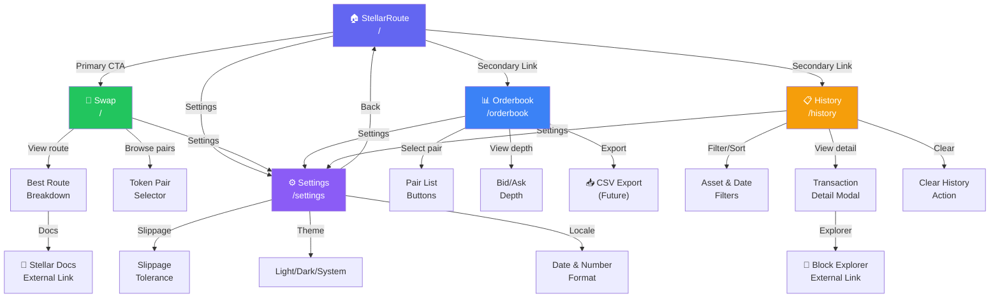

# Information Architecture Map & Navigation Rules
**Issue:** #463 — IA diagram and navigation rules for primary app sections  
**Milestone:** M4 — Web UI  
**Complexity:** Medium  
**Status:** Ready for Implementation  

## Overview

This spec documents StellarRoute's information architecture, including the navigation hierarchy, entry points, cross-links, mobile behavior, and deep-link prefill targets. All recommendations align with the existing `AppShell`, `Header`, and `MobileNav` components.

### Guiding Principles
- **Single Entry Point:** Swap page (`/`) is the primary destination
- **Task-Focused Sections:** Each major surface supports a distinct user task
- **Progressive Disclosure:** Advanced features (analytics, docs) available but not prominent
- **Mobile-First:** Navigation adapts responsively from hamburger menu to top nav
- **Deep Linking:** All routes support URL-based state prefill for sharing & bookmarking

---

## Site Structure Diagram



### Legend
- **Primary CTA:** Direct navigation path (high visibility)
- **Secondary Link:** Available but not prominent (in navigation)
- **Modal/Detail:** Inline or modal interactions within a page
- **External:** Links that navigate away from StellarRoute

---

## Navigation Hierarchy

### Primary Navigation (Top-Level)

| Route | Path | Label | Icon | Prominence | Mobile | Desktop |
|-------|------|-------|------|------------|--------|---------|
| Home | `/` | Swap | 💱 | **Primary** | Main button | Hero CTA |
| Orderbook | `/orderbook` | Orderbook | 📊 | Secondary | Nav item | Nav item |
| History | `/history` | History | 📋 | Secondary | Nav item | Nav item |
| Settings | `/settings` | Settings | ⚙️ | Tertiary | Nav item | Header icon |

### Desktop Navigation

**Header Layout** (Left to Right):
```
┌─────────────────────────────────────────────────────────┐
│ Logo │ Swap | Orderbook | History │ Network │ Theme │ 🔗 │
└─────────────────────────────────────────────────────────┘
```

**Desktop Behavior:**
- Top nav always visible (sticky)
- Active route highlighted with underline
- Settings accessible via gear icon or `/settings` link
- Max 3 main nav items (Swap, Orderbook, History)
- Network badge shows active chain
- Theme toggle in right section

**Component Reference:** `frontend/components/layout/header.tsx`

### Mobile Navigation

**Header Layout** (Left to Right):
```
┌─────────────────────────────────────────────────┐
│ Logo │  (spacer)  │ Network │ Theme │ ☰ Menu │
└─────────────────────────────────────────────────┘
```

**Mobile Menu (Sheet Drawer)**
```
┌──────────────────────────┐
│ Menu                 ✕   │
├──────────────────────────┤
│ Swap                     │
│ Orderbook                │
│ History                  │
│ Settings                 │
├──────────────────────────┤
│ Network: Testnet/Mainnet │
│ Theme: 🌙 Dark          │
└──────────────────────────┘
```

**Mobile Behavior:**
- Hamburger menu (≤768px viewport)
- Sheet drawer slides in from right
- Links stack vertically with full touch targets (48px min height)
- Active route shows underline + background
- Closes on route change
- Theme toggle & network badge duplicated in drawer

**Component Reference:** `frontend/components/layout/mobile-nav.tsx`

---

## Primary Surfaces & User Flows

### Surface 1: Swap Page (`/`)

**Purpose:** Discover and execute token swaps with real-time price quotes  
**Entry Points:**
- Direct URL (`/`)
- "Swap" link in primary navigation
- "Make your first swap" CTA from History (empty state)

**Layout & Components:**
```
┌─────────────────────────────────────┐
│           Header                    │
├─────────────────────────────────────┤
│                                     │
│    ┌───────────────────────────┐    │
│    │  Swap Card (Centered)     │    │
│    │  - Pay / Receive inputs   │    │
│    │  - Token selectors        │    │
│    │  - Route breakdown        │    │
│    │  - Swap CTA               │    │
│    └───────────────────────────┘    │
│                                     │
│    ┌───────────────────────────┐    │
│    │ Transaction Info (Future) │    │
│    └───────────────────────────┘    │
│                                     │
├─────────────────────────────────────┤
│           Footer                    │
└─────────────────────────────────────┘
```

**Key Interactions:**
1. **Pair Selection:** Click token buttons or use selector
2. **Amount Entry:** User enters pay amount
3. **Quote Fetch:** Real-time quote updates on amount change
4. **Route Preview:** Best route displays with fees & impact
5. **Swap Execution:** Click "Swap" → Confirmation modal → Execute
6. **Settings Access:** Slippage/theme toggle in card header

**Key States:**
- Empty (no pair selected)
- Loading (fetching quote)
- Quote ready (ready to swap)
- No liquidity (error state)
- Network error (error state)

**Related Deep-Links:**
- See [Deep-Link Targeting](#deep-link-targeting) section

---

### Surface 2: Orderbook Page (`/orderbook`)

**Purpose:** Explore live trading pairs, orderbook depth, and market data  
**Entry Points:**
- "Orderbook" link in navigation
- Direct URL (`/orderbook`)
- Analytics tab (future)

**Layout & Components:**
```
┌──────────────────────────────────────────┐
│            Header                        │
├──────────────────────────────────────────┤
│                                          │
│  ┌────────────────────────────────────┐  │
│  │ Available Pairs (Pill Buttons)     │  │
│  │ XLM/USDC | XLM/EURC | USDC/EURC  │  │
│  └────────────────────────────────────┘  │
│                                          │
│  ┌──────────────┬──────────────────────┐ │
│  │   Bids       │       Asks           │ │
│  │              │                      │ │
│  │ Price Qty    │ Price Qty            │ │
│  │ 1.00  1000k  │ 1.01  500k           │ │
│  │ 0.99  500k   │ 1.02  250k           │ │
│  └──────────────┴──────────────────────┘ │
│                                          │
├──────────────────────────────────────────┤
│           Footer                         │
└──────────────────────────────────────────┘
```

**Key Interactions:**
1. **Pair Selection:** Click pill buttons to switch pairs
2. **Orderbook View:** Full depth (bid/ask columns)
3. **Real-time Updates:** Rates stream live (via WebSocket)
4. **Filtering:** Sort by price/volume (future)
5. **Export:** CSV download (future)
6. **Refresh:** Manual refresh button

**Key States:**
- Loading markets
- No markets available (indexer still syncing)
- No orderbook entries (zero liquidity)
- Orderbook loaded
- Network error

**Mobile Considerations:**
- Pair pills scroll horizontally
- Bid/ask columns stack on narrow viewports
- Horizontal scroll with touch hints

---

### Surface 3: History Page (`/history`)

**Purpose:** View personal transaction history, filter, and export data  
**Entry Points:**
- "History" link in navigation
- Direct URL (`/history`)

**Layout & Components:**
```
┌──────────────────────────────────────────┐
│           Header                         │
├──────────────────────────────────────────┤
│                                          │
│  Header: "Transaction History"           │
│  Wallet: 0x1234...5678  [Copy] [Refresh]│
│                                          │
│  ┌──────────────┬────────────┬───────┐  │
│  │ Filter Asset │ Sort By    │ Clear │  │
│  │ All Tokens ▼ │ Date ▼     │ ✕     │  │
│  └──────────────┴────────────┴───────┘  │
│                                          │
│  ┌──────────────────────────────────────┐│
│  │ Date         │ Swap    │ Rate  │ Status│
│  ├──────────────────────────────────────┤│
│  │ May 29, 2026 │ USDC→XLM│ 1.01 │ ✅   │
│  │ May 28, 2026 │ XLM→EURC│ 0.85 │ ✅   │
│  └──────────────────────────────────────┘│
│                                          │
├──────────────────────────────────────────┤
│           Footer                         │
└──────────────────────────────────────────┘
```

**Key Interactions:**
1. **Filter:** By asset dropdown
2. **Sort:** By date or amount
3. **Clear:** Reset all filters
4. **Export:** Download as CSV (future)
5. **Detail View:** Click row → Transaction detail modal
6. **External Link:** "View on Explorer" → Opens block explorer

**Key States:**
- Loading
- No transactions (fresh wallet)
- Transactions loaded
- Filters too restrictive (no results)
- Network error

**Mobile Considerations:**
- Table converts to card list layout
- Filters in horizontal scrollable bar
- Full-width touch targets

---

### Surface 4: Settings Page (`/settings`)

**Purpose:** Configure user preferences for trading, theme, and localization  
**Entry Points:**
- "Settings" link in navigation or header
- Direct URL (`/settings`)
- Settings icon in header (desktop)

**Layout & Components:**
```
┌──────────────────────────────────────────┐
│           Header                         │
├──────────────────────────────────────────┤
│                                          │
│  Settings                                │
│                                          │
│  ┌──────────────────────────────────────┐│
│  │ Locale                               ││
│  │ Date Format: [Locale Selector ▼]     ││
│  └──────────────────────────────────────┘│
│                                          │
│  ┌──────────────────────────────────────┐│
│  │ Trade Settings                       ││
│  │ Slippage Tolerance: [0.5] %          ││
│  │ (Range: 0 - 50%)                     ││
│  └──────────────────────────────────────┘│
│                                          │
│  ┌──────────────────────────────────────┐│
│  │ Theme                                ││
│  │ ⚪ Light | ⚫ Dark | ⊙ System        ││
│  └──────────────────────────────────────┘│
│                                          │
│  [Reset to Defaults]                     │
│                                          │
├──────────────────────────────────────────┤
│           Footer                         │
└──────────────────────────────────────────┘
```

**Settings Scope:**

| Setting | Key | Range | Default | Storage |
|---------|-----|-------|---------|---------|
| **Slippage Tolerance** | `slippageTolerance` | 0 - 50% | 0.5% | `localStorage` |
| **Theme** | `theme` | light \| dark \| system | system | `localStorage` + URL |
| **Locale** | `locale` | en-US, en-GB, etc. | Browser lang | `localStorage` |

**Key Interactions:**
1. **Slippage Input:** Number field with validation (0-50%)
2. **Theme Toggle:** Radio buttons (light/dark/system)
3. **Locale Selector:** Dropdown with supported locales
4. **Reset:** Clears all settings to defaults
5. **Back:** Returns to previous page

**Storage & Persistence:**
```typescript
// Settings stored in localStorage
const STORAGE_KEY = 'stellar_route_settings';

interface Settings {
  slippageTolerance: number;  // 0.5 default
  theme: 'light' | 'dark' | 'system';
  locale: Locale;  // en-US default
}
```

**Provider Reference:** `frontend/components/providers/settings-provider.tsx`

---

## Deep-Link Targeting

### Swap Page Prefill

Users can share swap links with pair and amount prefilled via URL parameters.

#### Parameters

| Parameter | Type | Example | Notes |
|-----------|------|---------|-------|
| `base` | asset code | `XLM` | Token to sell (optional) |
| `quote` | asset code | `USDC` | Token to buy (optional) |
| `amount` | string (decimal) | `100.5` | Amount to sell (optional) |
| `type` | "sell" \| "buy" | `sell` | Trade direction (default: `sell`) |

#### URL Examples

```
# Swap 100 XLM for USDC
https://stellarroute.xyz/?base=XLM&quote=USDC&amount=100&type=sell

# Quote 50 EURC to XLM
https://stellarroute.xyz/?base=EURC&quote=XLM&amount=50&type=sell

# Buy 1000 USDC with XLM (reverse direction)
https://stellarroute.xyz/?base=XLM&quote=USDC&amount=1000&type=buy
```

#### Implementation

```typescript
// In swap page component
const searchParams = useSearchParams();
const base = searchParams.get('base');
const quote = searchParams.get('quote');
const amount = searchParams.get('amount');
const type = searchParams.get('type') as 'sell' | 'buy' || 'sell';

useEffect(() => {
  if (base) setFromToken(base);
  if (quote) setToToken(quote);
  if (amount) setFromAmount(amount);
  // Fetch quote automatically
}, [base, quote, amount]);
```

#### Social Sharing Example

```
🚀 Just swapped on StellarRoute!
Trade 100 XLM for USDC with best routing:
https://stellarroute.xyz/?base=XLM&quote=USDC&amount=100&type=sell

#Stellar #DEX #DeFi
```

---

### Orderbook Page Deep-Links

#### Parameters

| Parameter | Type | Example | Notes |
|-----------|------|---------|-------|
| `pair` | string | `XLM/USDC` | Trading pair (base/counter format) |

#### URL Examples

```
# View XLM/USDC orderbook
https://stellarroute.xyz/orderbook?pair=XLM/USDC

# View EURC/USDC orderbook
https://stellarroute.xyz/orderbook?pair=EURC/USDC
```

#### Implementation

```typescript
const searchParams = useSearchParams();
const pairParam = searchParams.get('pair');

useEffect(() => {
  if (pairParam) {
    const [base, counter] = pairParam.split('/');
    selectPair(base, counter);
  }
}, [pairParam]);
```

---

### History Page Deep-Links

#### Parameters

| Parameter | Type | Example | Notes |
|-----------|------|---------|-------|
| `asset` | asset code | `USDC` | Filter by asset |
| `status` | status | `success` | Filter by status: success, failed, pending |

#### URL Examples

```
# View USDC transactions
https://stellarroute.xyz/history?asset=USDC

# View failed transactions
https://stellarroute.xyz/history?status=failed

# View USDC failures
https://stellarroute.xyz/history?asset=USDC&status=failed
```

---

### Settings Page Deep-Links

Settings are typically not deep-linked but stored in `localStorage`. However, URL parameters can override defaults for testing:

#### Parameters (Optional)

| Parameter | Type | Example | Notes |
|-----------|------|---------|-------|
| `theme` | string | `dark` | Override theme (light/dark/system) |
| `locale` | string | `en-GB` | Override locale |
| `slippage` | string | `1.5` | Override slippage tolerance |

#### URL Example

```
# Test dark theme with GB locale
https://stellarroute.xyz/settings?theme=dark&locale=en-GB
```

---

## Navigation Rules & Patterns

### Cross-Page Navigation

**From Swap → Orderbook:**
- "View markets" button in market selector modal
- Links to `/orderbook?pair=<selected_pair>`

**From Swap → History:**
- "View your trades" in empty state
- Links to `/history`

**From Orderbook → Swap:**
- "Swap this pair" button under orderbook
- Links to `/?base=<base>&quote=<counter>&type=sell`

**From History → Swap:**
- "Make first swap" empty state CTA
- Links to `/`

**From Any Page → Settings:**
- Settings icon in header or nav menu
- Links to `/settings`
- **Go back behavior:** Browser back button returns to previous page

### Active Route Indicator

**Desktop Navigation:**
```css
/* Underline for active route */
a[aria-current="page"] {
  text-decoration: underline;
  text-decoration-thickness: 2px;
  text-underline-offset: 4px;
}
```

**Mobile Navigation:**
```css
/* Background highlight for active route */
.mobile-nav a[aria-current="page"] {
  background-color: var(--accent);
  color: var(--accent-foreground);
}
```

### Focus Management

**Desktop:**
- Tab key navigates through nav items left-to-right
- Enter/Space activates link

**Mobile:**
- Focus visible when drawer is open
- Screen readers announce active page

**Accessibility Attributes:**
```tsx
<a
  href="/swap"
  aria-current={pathname === '/swap' ? 'page' : undefined}
  aria-disabled={disabled}
>
  Swap
</a>
```

---

## Mobile Layout Breakpoints

### Viewport Sizes

| Size | Breakpoint | Behavior | Nav Style |
|------|-----------|----------|-----------|
| < 640px | Mobile | Single-column, touch optimized | Hamburger menu |
| 640–1024px | Tablet | 2-column grid possible | Adaptive (hamburger or inline) |
| > 1024px | Desktop | Full-width nav, sidebar ready | Sticky top nav |

### Navigation Responsive Behavior

```tsx
// Tailwind responsive classes
// Hide desktop nav on mobile
<nav className="hidden md:flex">

// Show mobile hamburger on small screens
<button className="md:hidden">
  <Menu />
</button>
```

### Touch Targets

- Minimum height: 48px
- Minimum width: 48px
- Padding: 12px

```css
/* Ensure all interactive elements meet 48px minimum */
button, a[role="button"], input {
  min-height: 48px;
  min-width: 48px;
}
```

---

## Accessibility & Navigation

### Screen Reader Announcements

```tsx
// Main landmark
<main role="main">

// Nav landmark
<nav aria-label="Main navigation">

// Current page indicator
<a aria-current="page">

// Mobile menu drawer
<Sheet role="dialog" aria-labelledby="mobile-menu-title">
```

### Keyboard Navigation

| Key | Action |
|-----|--------|
| Tab | Next nav item |
| Shift+Tab | Previous nav item |
| Enter/Space | Activate link |
| Esc | Close mobile menu drawer |
| ↑/↓ | (in dropdown/dialog) Next/previous option |

### Mobile Menu Drawer (ARIA)

```tsx
<Sheet
  role="dialog"
  aria-labelledby="mobile-menu-title"
  aria-modal="true"
>
  <SheetTitle id="mobile-menu-title">Menu</SheetTitle>
  <nav aria-label="Mobile navigation">
    {/* Nav items */}
  </nav>
</Sheet>
```

---

## Implementation Checklist

### Navigation Structure
- [ ] Primary nav items: Swap, Orderbook, History
- [ ] Secondary items: Settings accessible from nav + header
- [ ] Desktop nav sticky with backdrop blur
- [ ] Mobile hamburger icon visible < 768px
- [ ] Sheet drawer slides in from right (mobile)

### Component Updates
- [ ] Update `header.tsx` with final nav items
- [ ] Update `mobile-nav.tsx` with drawer behavior
- [ ] Update `app-shell.tsx` with layout logic
- [ ] Add `aria-current="page"` to active links
- [ ] Test keyboard navigation (Tab, Enter, Esc)

### Deep-Linking
- [ ] Swap page reads `base`, `quote`, `amount` from URL
- [ ] Orderbook page reads `pair` from URL
- [ ] History page reads `asset`, `status` from URL
- [ ] Settings page reads theme/locale from URL (optional)
- [ ] All parameters validated and sanitized

### Mobile Testing
- [ ] Nav drawer opens/closes smoothly
- [ ] Touch targets 48px minimum
- [ ] Pair pills scroll horizontally on narrow viewports
- [ ] Tables convert to card layouts on mobile
- [ ] No horizontal scrolling at 320px

### Accessibility
- [ ] Screen reader announces active page
- [ ] All nav items keyboard accessible
- [ ] Focus visible on all interactive elements
- [ ] Mobile menu closes on route change
- [ ] ARIA landmarks used: `role="main"`, `aria-label="navigation"`

### Documentation
- [ ] Add this IA spec to Design System (Confluence/Docs)
- [ ] Create Figma component for nav patterns
- [ ] Document deep-link format in API docs
- [ ] Update URL patterns in shared sharing guidelines

---

## Future Enhancements

### Phase 2: Advanced Analytics
- [ ] Add `/analytics` route with trading stats
- [ ] Add `/pools` route with pool finder
- [ ] Side navigation for advanced users

### Phase 3: Wallet Integration
- [ ] Add user account menu in header
- [ ] Portfolio overview in separate panel
- [ ] Connected wallet display

### Phase 4: Multi-Language Nav
- [ ] Translate nav labels based on locale
- [ ] RTL support for Arabic/Hebrew
- [ ] Language selector in settings

### Phase 5: PWA & Offline
- [ ] Service worker caching
- [ ] Offline route indicators
- [ ] Reload prompts when update available

---

## Alignment with Existing Components

### AppShell (`frontend/components/layout/app-shell.tsx`)
- Routes with `pathname.startsWith("/orderbook")` → Full-width layout
- Swap & History pages → Centered container (max-width: 7xl)
- Maintains consistent padding/spacing across surfaces

### Header (`frontend/components/layout/header.tsx`)
- Sticky positioning with backdrop blur
- Logo links to root (`/`)
- Nav items: Swap, Orderbook, History
- Network badge & theme toggle
- Mobile hamburger on small screens

### MobileNav (`frontend/components/layout/mobile-nav.tsx`)
- Sheet drawer from right (mobile)
- Closes on route change
- Includes network badge & theme toggle
- Touch-optimized link targets

---

## Design Review Sign-Off

**Issue:** #463  
**Review Date:** [TO BE FILLED BY DESIGN TEAM]  
**Reviewer:** [TO BE FILLED]  
**Status:** ⬜ Pending → ✅ Approved  

**Sign-Off Comment:**

---

## Related Issues & Documentation

- **#461:** Empty-state design (integrates with this IA)
- **#462:** Accessibility contrast (nav colors must meet standards)
- [AppShell Component](../../frontend/components/layout/app-shell.tsx)
- [Header Component](../../frontend/components/layout/header.tsx)
- [MobileNav Component](../../frontend/components/layout/mobile-nav.tsx)
- [Settings Provider](../../frontend/components/providers/settings-provider.tsx)
- [Next.js App Router Docs](https://nextjs.org/docs/app)
- [WCAG Navigation Patterns](https://www.w3.org/WAI/tutorials/menus/)
