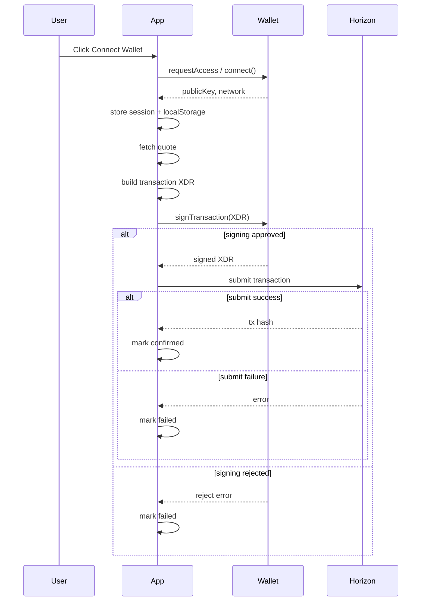

# Wallet Integration Developer Guide

This guide explains how StellarRoute's frontend integrates Stellar wallets, including Freighter and xBull. It covers wallet detection, connection state, transaction signing, network handling, and local development/testing.

## Supported wallets

StellarRoute currently recognizes two browser wallet extensions:

- **Freighter**
  - Detected via `@stellar/freighter-api`.
  - Uses `isAllowed()` to check whether the extension/site access is available.
  - Connects with `requestAccess()`, then reads `getAddress()` and `getNetworkDetails()`.
  - Supports signing via `signTransaction(xdr, { networkPassphrase })`.

- **xBull**
  - Detected by checking `window.xbull` in the browser.
  - Connects via `window.xbull.connect()` and returns `publicKey`.
  - Current implementation only supports connection. Transaction signing for xBull is not implemented today.

## Detection logic

Wallet availability is managed in `frontend/lib/wallet/index.ts`.

- `getAvailableWallets()` returns an array of supported wallet objects.
- Freighter is reported installed if `isAllowed()` returns `true`.
- xBull is reported installed when a global `window.xbull` object exists.

This list powers UI state in `frontend/components/shared/wallet-button.tsx` and the `WalletProvider`.

## Connection lifecycle

Connection is orchestrated in `frontend/components/providers/wallet-provider.tsx`.

### Primary flow

1. User clicks a wallet connect button.
2. `WalletProvider.connect()` calls `connectWallet(selectedWalletId)`.
3. `connectWallet()` performs a wallet-specific handshake and returns a `WalletSession`.
4. `WalletProvider` stores:
   - `address`
   - `walletId`
   - `walletNetwork`
   - `isConnected`

### Persistent state

The provider persists these values in browser `localStorage`:

- `stellarroute.wallet.autoReconnect` — user preference for reconnecting on page reload.
- `stellarroute.wallet.lastWalletId` — last chosen wallet adapter.
- `stellarroute.wallet.address` — connected account address.
- `stellarroute.wallet.walletId` — connected wallet adapter ID.

### Auto-reconnect

On initial page load, `WalletProvider` attempts auto-reconnect when:

- `autoReconnectPreferred` is `true`
- no wallet is currently connected
- there is a saved `lastWalletId`

The reconnect process verifies the saved wallet is still installed and then reuses `connectWallet()`.

### Disconnect and refresh

- `disconnect()` resets the session state to disconnected.
- `refreshAccount()` retries wallet session refresh with the current adapter and updates address/network.

### Transaction guard rails

The provider prevents wallet switching or refresh while `isTransactionPending` is `true`.
This avoids mid-flight transaction state changes during sign/submit flows.

### Cross-tab sync

`WalletProvider` listens for `window.storage` events on wallet session keys. If another tab changes the stored wallet or address, the app can detect the mismatch and surface sync state.

## Transaction signing and submission pipeline

The swap transaction lifecycle is implemented in `frontend/hooks/useTransactionLifecycle.ts`.

The core pipeline is:

1. `initiateSwap()` starts a pending transaction record.
2. `signTransaction()` is called.
3. If signing succeeds, the transaction is submitted.
4. The status transitions through `pending`, `submitted`, and `confirmed` or `failed`.

### Signer injection

`useTransactionLifecycle` accepts injectable callbacks:

- `signTransaction?: (xdr: string) => Promise<string>`
- `submitTransaction?: (signedXdr: string) => Promise<{ hash: string }>`

This makes the flow testable and allows wallet adapter wiring to be injected.

### Default implementation

The default hook behavior uses stubs:

- `defaultSignTransaction()` simulates a wallet signature.
- `defaultSubmitTransaction()` simulates submission to Horizon.

### Wallet-based signing

Real wallet signing is handled by `frontend/lib/wallet/signTransactionWithWallet()`.

- Freighter: supported via `@stellar/freighter-api` and returns a signed XDR.
- xBull: currently not implemented for signing.

A new adapter should implement signing in `signTransactionWithWallet()` and wire it into swap flows.

### Error handling

`useTransactionLifecycle` classifies common failures:

- User rejection during signing becomes a user-facing `Signature rejected` error.
- Network or submission failures become `failed` transaction status.
- A missed Horizon confirmation transitions a submitted transaction to `dropped` after a deadline.

## Network selection and environment configuration

Network state is managed at the provider level and compared against the connected wallet.

### App network

`frontend/app/providers.tsx` currently initializes the wallet provider with:

```tsx
<WalletProvider defaultNetwork="testnet">
```

This means the app assumes the frontend is running on Stellar testnet. A network mismatch is computed as:

- `network`: app-selected target network
- `walletNetwork`: wallet-reported network

If these differ, UI components such as network mismatch banners can warn the user.

### Wallet network handling

- Freighter reports the wallet network via `getNetworkDetails()`.
- xBull currently returns a hardcoded `testnet` network in this implementation.

### Local development configuration

The frontend backend API URL is controlled by `NEXT_PUBLIC_API_URL`.
For example, to use a local backend:

```env
NEXT_PUBLIC_API_URL=http://localhost:8080
```

The wallet adapter itself does not use this env var, but backend/network alignment is still required for valid swaps.

## Testing locally with Freighter and xBull

### Recommended setup

1. Install the browser extension:
   - Freighter: https://www.freighter.app/
   - xBull: https://wallet.xbull.app/
2. Open the app at `http://localhost:3000`.
3. Unlock the wallet extension and grant site access.
4. Connect using the wallet button in the UI.

### What to expect

- If no wallet is detected, the UI shows `No supported wallet found`.
- Freighter requires site access and may prompt for permission approval.
- xBull must expose `window.xbull` before it appears as available.

### Debugging

- Reload the page after installing the extension.
- If the wallet is not found, confirm the extension supports `localhost` origins.
- Use browser devtools to inspect `window.xbull` and Freighter API availability.

### Testing without a real wallet

The repository includes mocks and test helpers for wallet behavior:

- `frontend/__mocks__/@stellar/freighter-api.ts`
- wallet provider tests in `frontend/components/providers/__tests__/wallet-sync.test.tsx`

## Adding a new wallet adapter

The adapter entrypoint is `frontend/lib/wallet/index.ts`.

To add a new wallet:

1. Update `SupportedWallet` in `frontend/lib/wallet/types.ts`.
2. Add a label in `WALLET_LABELS`.
3. Add detection logic to `getAvailableWallets()`.
4. Implement connection logic in `connectWallet()`.
5. Implement `refreshWalletSession()` to refresh address and network state.
6. Implement signing in `signTransactionWithWallet()` if the wallet supports transaction signing.
7. Update persistence and reconnection behavior in `frontend/components/providers/wallet-provider.tsx` if needed.
8. Add unit tests for connect/disconnect, session refresh, network mismatch, and pending-transaction guards.

### Extension points in code

- `frontend/components/providers/wallet-provider.tsx`
  - connection lifecycle
  - localStorage persistence
  - auto-reconnect
  - pending transaction guards

- `frontend/lib/wallet/index.ts`
  - wallet detection
  - connect/disconnect
  - transaction signing
  - refresh session

- `frontend/lib/wallet/types.ts`
  - wallet identity and network model

## Known limitations and UX expectations

- **xBull signing is not implemented** in the current adapter. xBull can connect, but swap submission may not be functional until signing is wired in.
- **Freighter is the only wallet with full signing support** today.
- **Network mismatch** is detected and surfaced, but the app currently defaults to `testnet`.
- **Wallet state is stored in localStorage**, so stale sessions can persist across tabs or reloads.
- **Pending transactions lock wallet switching** to prevent mid-flight state changes.
- **User denial flows** should show explicit messages such as `Connection request was rejected.` or `Signature rejected.`
- **Empty wallet list** means the browser did not expose any supported wallet adapters.

## Sequence diagram


